Introduction
============

Intro Text goes here.......

### Required Packages

This RMD requires the following R packages to run:

-   formattable
-   fpp

If you do not currently have installed any of these packages, please
uncomment the install.packages lines below before knitting this file.

**This list is for different project...need to clean up as we go...**

    #install.packages("formattable")
    #install.packages("fpp")

    library(formattable)
    library(fpp)
    library(ggplot2)
    library(reshape2)

Data Load
=========

Data Load Intro Text goes here.....

### AsIs Chulwalar Data

    knitr::read_chunk(paste0(DataLoad,'/LoadAsIs.R'))

To start, we need to load our As Is Chulwar Data. This data has been
sourced from the SMU 2DS platform Unit 10.2 Overview page.

    AsIsChulwar<-read.csv(paste0(DataLoad,"/ImportedAsIsDataChulwalar.csv"), header = FALSE,sep = ";")

With our data loaded, lets review the structure and a small subset of
data from the output to give a baseline for cleanup.

    ##Review Structure
    str(AsIsChulwar)

    ## 'data.frame':    98 obs. of  8 variables:
    ##  $ V1: Factor w/ 22 levels "","Apr","Aug",..: 19 9 8 13 2 14 11 10 3 18 ...
    ##  $ V2: int  2008 2313221 1950131 2346635 2039787 1756964 1458302 1679637 1639670 2882886 ...
    ##  $ V3: int  2009 2610573 2371327 2743786 2125308 1850073 1836222 1797311 1851968 3271171 ...
    ##  $ V4: int  2010 2760688 2918333 3227041 1613888 2550157 2317645 1474144 2148521 3898571 ...
    ##  $ V5: int  2011 3112861 2926663 3294784 2577079 2774068 2378227 2222900 2991787 4151531 ...
    ##  $ V6: int  2012 3093088 3679308 3433364 2714899 3011767 2726028 2483834 3055655 4200796 ...
    ##  $ V7: int  2013 4119526 3535744 3560974 3760065 2959933 2787898 2828744 3084113 5107775 ...
    ##  $ V8: int  2014 4308161 4155378 3924332 3659121 3898758 3313891 3595106 3502426 5619059 ...

    ##Review Head 30 Records
    formattable(head(AsIsChulwar,30))

<table style="width:106%;">
<colgroup>
<col width="18%" />
<col width="12%" />
<col width="12%" />
<col width="12%" />
<col width="12%" />
<col width="12%" />
<col width="12%" />
<col width="12%" />
</colgroup>
<thead>
<tr class="header">
<th align="right">V1</th>
<th align="right">V2</th>
<th align="right">V3</th>
<th align="right">V4</th>
<th align="right">V5</th>
<th align="right">V6</th>
<th align="right">V7</th>
<th align="right">V8</th>
</tr>
</thead>
<tbody>
<tr class="odd">
<td align="right">Total As Is</td>
<td align="right">2008</td>
<td align="right">2009</td>
<td align="right">2010</td>
<td align="right">2011</td>
<td align="right">2012</td>
<td align="right">2013</td>
<td align="right">2014</td>
</tr>
<tr class="even">
<td align="right">Jan</td>
<td align="right">2313221</td>
<td align="right">2610573</td>
<td align="right">2760688</td>
<td align="right">3112861</td>
<td align="right">3093088</td>
<td align="right">4119526</td>
<td align="right">4308161</td>
</tr>
<tr class="odd">
<td align="right">Feb</td>
<td align="right">1950131</td>
<td align="right">2371327</td>
<td align="right">2918333</td>
<td align="right">2926663</td>
<td align="right">3679308</td>
<td align="right">3535744</td>
<td align="right">4155378</td>
</tr>
<tr class="even">
<td align="right">Mar</td>
<td align="right">2346635</td>
<td align="right">2743786</td>
<td align="right">3227041</td>
<td align="right">3294784</td>
<td align="right">3433364</td>
<td align="right">3560974</td>
<td align="right">3924332</td>
</tr>
<tr class="odd">
<td align="right">Apr</td>
<td align="right">2039787</td>
<td align="right">2125308</td>
<td align="right">1613888</td>
<td align="right">2577079</td>
<td align="right">2714899</td>
<td align="right">3760065</td>
<td align="right">3659121</td>
</tr>
<tr class="even">
<td align="right">May</td>
<td align="right">1756964</td>
<td align="right">1850073</td>
<td align="right">2550157</td>
<td align="right">2774068</td>
<td align="right">3011767</td>
<td align="right">2959933</td>
<td align="right">3898758</td>
</tr>
<tr class="odd">
<td align="right">Jun</td>
<td align="right">1458302</td>
<td align="right">1836222</td>
<td align="right">2317645</td>
<td align="right">2378227</td>
<td align="right">2726028</td>
<td align="right">2787898</td>
<td align="right">3313891</td>
</tr>
<tr class="even">
<td align="right">Jul</td>
<td align="right">1679637</td>
<td align="right">1797311</td>
<td align="right">1474144</td>
<td align="right">2222900</td>
<td align="right">2483834</td>
<td align="right">2828744</td>
<td align="right">3595106</td>
</tr>
<tr class="odd">
<td align="right">Aug</td>
<td align="right">1639670</td>
<td align="right">1851968</td>
<td align="right">2148521</td>
<td align="right">2991787</td>
<td align="right">3055655</td>
<td align="right">3084113</td>
<td align="right">3502426</td>
</tr>
<tr class="even">
<td align="right">Sep</td>
<td align="right">2882886</td>
<td align="right">3271171</td>
<td align="right">3898571</td>
<td align="right">4151531</td>
<td align="right">4200796</td>
<td align="right">5107775</td>
<td align="right">5619059</td>
</tr>
<tr class="odd">
<td align="right">Oct</td>
<td align="right">2959716</td>
<td align="right">2818888</td>
<td align="right">3348953</td>
<td align="right">3318684</td>
<td align="right">4228724</td>
<td align="right">4562144</td>
<td align="right">5274287</td>
</tr>
<tr class="even">
<td align="right">Nov</td>
<td align="right">2596494</td>
<td align="right">3310776</td>
<td align="right">3135945</td>
<td align="right">4037076</td>
<td align="right">4618540</td>
<td align="right">4729313</td>
<td align="right">4841693</td>
</tr>
<tr class="odd">
<td align="right">Dec</td>
<td align="right">2656568</td>
<td align="right">3022513</td>
<td align="right">3332886</td>
<td align="right">3429843</td>
<td align="right">3383673</td>
<td align="right">4372181</td>
<td align="right">4664854</td>
</tr>
<tr class="even">
<td align="right"></td>
<td align="right">NA</td>
<td align="right">NA</td>
<td align="right">NA</td>
<td align="right">NA</td>
<td align="right">NA</td>
<td align="right">NA</td>
<td align="right">NA</td>
</tr>
<tr class="odd">
<td align="right">Efak As Is</td>
<td align="right">2008</td>
<td align="right">2009</td>
<td align="right">2010</td>
<td align="right">2011</td>
<td align="right">2012</td>
<td align="right">2013</td>
<td align="right">NA</td>
</tr>
<tr class="even">
<td align="right">Jan</td>
<td align="right">416589</td>
<td align="right">430055</td>
<td align="right">508177</td>
<td align="right">778643</td>
<td align="right">849409</td>
<td align="right">1065097</td>
<td align="right">NA</td>
</tr>
<tr class="odd">
<td align="right">Feb</td>
<td align="right">472565</td>
<td align="right">468187</td>
<td align="right">601115</td>
<td align="right">726254</td>
<td align="right">1021474</td>
<td align="right">952195</td>
<td align="right">NA</td>
</tr>
<tr class="even">
<td align="right">Mar</td>
<td align="right">466539</td>
<td align="right">648582</td>
<td align="right">775996</td>
<td align="right">943274</td>
<td align="right">1034025</td>
<td align="right">1062892</td>
<td align="right">NA</td>
</tr>
<tr class="odd">
<td align="right">Apr</td>
<td align="right">370774</td>
<td align="right">414990</td>
<td align="right">323532</td>
<td align="right">845136</td>
<td align="right">904449</td>
<td align="right">1057988</td>
<td align="right">NA</td>
</tr>
<tr class="even">
<td align="right">May</td>
<td align="right">457741</td>
<td align="right">466329</td>
<td align="right">672011</td>
<td align="right">1030397</td>
<td align="right">986452</td>
<td align="right">1127932</td>
<td align="right">NA</td>
</tr>
<tr class="odd">
<td align="right">Jun</td>
<td align="right">384817</td>
<td align="right">465775</td>
<td align="right">589895</td>
<td align="right">829198</td>
<td align="right">1011487</td>
<td align="right">933365</td>
<td align="right">NA</td>
</tr>
<tr class="even">
<td align="right">Jul</td>
<td align="right">464502</td>
<td align="right">430988</td>
<td align="right">438340</td>
<td align="right">741981</td>
<td align="right">862239</td>
<td align="right">1069867</td>
<td align="right">NA</td>
</tr>
<tr class="odd">
<td align="right">Aug</td>
<td align="right">389013</td>
<td align="right">502499</td>
<td align="right">483363</td>
<td align="right">820385</td>
<td align="right">1026357</td>
<td align="right">1020078</td>
<td align="right">NA</td>
</tr>
<tr class="even">
<td align="right">Sep</td>
<td align="right">508370</td>
<td align="right">584983</td>
<td align="right">630064</td>
<td align="right">851428</td>
<td align="right">898892</td>
<td align="right">1049970</td>
<td align="right">NA</td>
</tr>
<tr class="odd">
<td align="right">Oct</td>
<td align="right">495598</td>
<td align="right">506877</td>
<td align="right">608942</td>
<td align="right">873895</td>
<td align="right">1079994</td>
<td align="right">1197452</td>
<td align="right">NA</td>
</tr>
<tr class="even">
<td align="right">Nov</td>
<td align="right">529191</td>
<td align="right">593705</td>
<td align="right">688055</td>
<td align="right">996616</td>
<td align="right">1259730</td>
<td align="right">1283970</td>
<td align="right">NA</td>
</tr>
<tr class="odd">
<td align="right">Dec</td>
<td align="right">441545</td>
<td align="right">641582</td>
<td align="right">693058</td>
<td align="right">941611</td>
<td align="right">986962</td>
<td align="right">1280835</td>
<td align="right">NA</td>
</tr>
<tr class="even">
<td align="right"></td>
<td align="right">NA</td>
<td align="right">NA</td>
<td align="right">NA</td>
<td align="right">NA</td>
<td align="right">NA</td>
<td align="right">NA</td>
<td align="right">NA</td>
</tr>
<tr class="odd">
<td align="right">Wuge As Is</td>
<td align="right">2008</td>
<td align="right">2009</td>
<td align="right">2010</td>
<td align="right">2011</td>
<td align="right">2012</td>
<td align="right">2013</td>
<td align="right">NA</td>
</tr>
<tr class="even">
<td align="right">Jan</td>
<td align="right">414571</td>
<td align="right">462768</td>
<td align="right">525307</td>
<td align="right">507281</td>
<td align="right">545966</td>
<td align="right">752685</td>
<td align="right">NA</td>
</tr>
</tbody>
</table>

    ##Review Tail 30 Records
    formattable(tail(AsIsChulwar,30))

<table style="width:133%;">
<colgroup>
<col width="5%" />
<col width="38%" />
<col width="13%" />
<col width="13%" />
<col width="13%" />
<col width="13%" />
<col width="13%" />
<col width="13%" />
<col width="5%" />
</colgroup>
<thead>
<tr class="header">
<th align="left"></th>
<th align="right">V1</th>
<th align="right">V2</th>
<th align="right">V3</th>
<th align="right">V4</th>
<th align="right">V5</th>
<th align="right">V6</th>
<th align="right">V7</th>
<th align="right">V8</th>
</tr>
</thead>
<tbody>
<tr class="odd">
<td align="left">69</td>
<td align="right">Dec</td>
<td align="right">345955</td>
<td align="right">351651</td>
<td align="right">373302</td>
<td align="right">299115</td>
<td align="right">303450</td>
<td align="right">348558</td>
<td align="right">NA</td>
</tr>
<tr class="even">
<td align="left">70</td>
<td align="right"></td>
<td align="right">NA</td>
<td align="right">NA</td>
<td align="right">NA</td>
<td align="right">NA</td>
<td align="right">NA</td>
<td align="right">NA</td>
<td align="right">NA</td>
</tr>
<tr class="odd">
<td align="left">71</td>
<td align="right">Red Etel As Is</td>
<td align="right">2008</td>
<td align="right">2009</td>
<td align="right">2010</td>
<td align="right">2011</td>
<td align="right">2012</td>
<td align="right">2013</td>
<td align="right">NA</td>
</tr>
<tr class="even">
<td align="left">72</td>
<td align="right">Jan</td>
<td align="right">853776</td>
<td align="right">1175792</td>
<td align="right">1267682</td>
<td align="right">1286374</td>
<td align="right">1234541</td>
<td align="right">1722000</td>
<td align="right">NA</td>
</tr>
<tr class="odd">
<td align="left">73</td>
<td align="right">Feb</td>
<td align="right">736694</td>
<td align="right">1119734</td>
<td align="right">1331017</td>
<td align="right">1191422</td>
<td align="right">1362023</td>
<td align="right">1389184</td>
<td align="right">NA</td>
</tr>
<tr class="even">
<td align="left">74</td>
<td align="right">Mar</td>
<td align="right">1014008</td>
<td align="right">1115643</td>
<td align="right">1226866</td>
<td align="right">1122604</td>
<td align="right">1247246</td>
<td align="right">1299670</td>
<td align="right">NA</td>
</tr>
<tr class="odd">
<td align="left">75</td>
<td align="right">Apr</td>
<td align="right">812014</td>
<td align="right">885413</td>
<td align="right">589628</td>
<td align="right">773151</td>
<td align="right">755347</td>
<td align="right">1420039</td>
<td align="right">NA</td>
</tr>
<tr class="even">
<td align="left">76</td>
<td align="right">May</td>
<td align="right">660628</td>
<td align="right">719792</td>
<td align="right">958960</td>
<td align="right">734947</td>
<td align="right">1044249</td>
<td align="right">784033</td>
<td align="right">NA</td>
</tr>
<tr class="odd">
<td align="left">77</td>
<td align="right">Jun</td>
<td align="right">456630</td>
<td align="right">648758</td>
<td align="right">899709</td>
<td align="right">611045</td>
<td align="right">718482</td>
<td align="right">817182</td>
<td align="right">NA</td>
</tr>
<tr class="even">
<td align="left">78</td>
<td align="right">Jul</td>
<td align="right">566373</td>
<td align="right">698466</td>
<td align="right">412664</td>
<td align="right">627198</td>
<td align="right">729011</td>
<td align="right">764120</td>
<td align="right">NA</td>
</tr>
<tr class="odd">
<td align="left">79</td>
<td align="right">Aug</td>
<td align="right">610931</td>
<td align="right">644578</td>
<td align="right">781363</td>
<td align="right">975098</td>
<td align="right">980154</td>
<td align="right">796123</td>
<td align="right">NA</td>
</tr>
<tr class="even">
<td align="left">80</td>
<td align="right">Sep</td>
<td align="right">1266532</td>
<td align="right">1619860</td>
<td align="right">2006398</td>
<td align="right">1991259</td>
<td align="right">2030676</td>
<td align="right">2641226</td>
<td align="right">NA</td>
</tr>
<tr class="odd">
<td align="left">81</td>
<td align="right">Oct</td>
<td align="right">1392424</td>
<td align="right">1281524</td>
<td align="right">1487680</td>
<td align="right">1259658</td>
<td align="right">1720301</td>
<td align="right">1877924</td>
<td align="right">NA</td>
</tr>
<tr class="even">
<td align="left">82</td>
<td align="right">Nov</td>
<td align="right">1212117</td>
<td align="right">1507640</td>
<td align="right">1357176</td>
<td align="right">1570817</td>
<td align="right">1917408</td>
<td align="right">1850111</td>
<td align="right">NA</td>
</tr>
<tr class="odd">
<td align="left">83</td>
<td align="right">Dec</td>
<td align="right">1255369</td>
<td align="right">1263440</td>
<td align="right">1325761</td>
<td align="right">1414876</td>
<td align="right">1314697</td>
<td align="right">1713603</td>
<td align="right">NA</td>
</tr>
<tr class="even">
<td align="left">84</td>
<td align="right"></td>
<td align="right">NA</td>
<td align="right">NA</td>
<td align="right">NA</td>
<td align="right">NA</td>
<td align="right">NA</td>
<td align="right">NA</td>
<td align="right">NA</td>
</tr>
<tr class="odd">
<td align="left">85</td>
<td align="right">Total yearly Exports As Is</td>
<td align="right">2008</td>
<td align="right">2009</td>
<td align="right">2010</td>
<td align="right">2011</td>
<td align="right">2012</td>
<td align="right">2013</td>
<td align="right">NA</td>
</tr>
<tr class="even">
<td align="left">86</td>
<td align="right">Jan</td>
<td align="right">26280011</td>
<td align="right">29609916</td>
<td align="right">32726772</td>
<td align="right">37215503</td>
<td align="right">40629676</td>
<td align="right">45408410</td>
<td align="right">NA</td>
</tr>
<tr class="odd">
<td align="left">87</td>
<td align="right">Feb</td>
<td align="right">26280011</td>
<td align="right">29609916</td>
<td align="right">32726772</td>
<td align="right">37215503</td>
<td align="right">40629676</td>
<td align="right">45408410</td>
<td align="right">NA</td>
</tr>
<tr class="even">
<td align="left">88</td>
<td align="right">Mar</td>
<td align="right">26280011</td>
<td align="right">29609916</td>
<td align="right">32726772</td>
<td align="right">37215503</td>
<td align="right">40629676</td>
<td align="right">45408410</td>
<td align="right">NA</td>
</tr>
<tr class="odd">
<td align="left">89</td>
<td align="right">Apr</td>
<td align="right">26280011</td>
<td align="right">29609916</td>
<td align="right">32726772</td>
<td align="right">37215503</td>
<td align="right">40629676</td>
<td align="right">45408410</td>
<td align="right">NA</td>
</tr>
<tr class="even">
<td align="left">90</td>
<td align="right">May</td>
<td align="right">26280011</td>
<td align="right">29609916</td>
<td align="right">32726772</td>
<td align="right">37215503</td>
<td align="right">40629676</td>
<td align="right">45408410</td>
<td align="right">NA</td>
</tr>
<tr class="odd">
<td align="left">91</td>
<td align="right">Jun</td>
<td align="right">26280011</td>
<td align="right">29609916</td>
<td align="right">32726772</td>
<td align="right">37215503</td>
<td align="right">40629676</td>
<td align="right">45408410</td>
<td align="right">NA</td>
</tr>
<tr class="even">
<td align="left">92</td>
<td align="right">Jul</td>
<td align="right">26280011</td>
<td align="right">29609916</td>
<td align="right">32726772</td>
<td align="right">37215503</td>
<td align="right">40629676</td>
<td align="right">45408410</td>
<td align="right">NA</td>
</tr>
<tr class="odd">
<td align="left">93</td>
<td align="right">Aug</td>
<td align="right">26280011</td>
<td align="right">29609916</td>
<td align="right">32726772</td>
<td align="right">37215503</td>
<td align="right">40629676</td>
<td align="right">45408410</td>
<td align="right">NA</td>
</tr>
<tr class="even">
<td align="left">94</td>
<td align="right">Sep</td>
<td align="right">26280011</td>
<td align="right">29609916</td>
<td align="right">32726772</td>
<td align="right">37215503</td>
<td align="right">40629676</td>
<td align="right">45408410</td>
<td align="right">NA</td>
</tr>
<tr class="odd">
<td align="left">95</td>
<td align="right">Oct</td>
<td align="right">26280011</td>
<td align="right">29609916</td>
<td align="right">32726772</td>
<td align="right">37215503</td>
<td align="right">40629676</td>
<td align="right">45408410</td>
<td align="right">NA</td>
</tr>
<tr class="even">
<td align="left">96</td>
<td align="right">Nov</td>
<td align="right">26280011</td>
<td align="right">29609916</td>
<td align="right">32726772</td>
<td align="right">37215503</td>
<td align="right">40629676</td>
<td align="right">45408410</td>
<td align="right">NA</td>
</tr>
<tr class="odd">
<td align="left">97</td>
<td align="right">Dez</td>
<td align="right">26280011</td>
<td align="right">29609916</td>
<td align="right">32726772</td>
<td align="right">37215503</td>
<td align="right">40629676</td>
<td align="right">45408410</td>
<td align="right">NA</td>
</tr>
<tr class="even">
<td align="left">98</td>
<td align="right"></td>
<td align="right">NA</td>
<td align="right">NA</td>
<td align="right">NA</td>
<td align="right">NA</td>
<td align="right">NA</td>
<td align="right">NA</td>
<td align="right">NA</td>
</tr>
</tbody>
</table>

After reviewing this subset of data, it is apparent we have some cleanup
to do. It appears we have loaded one column for each year of data by
month(row). All export group forcasts have also been combined into a
list by repeating month/year data for each export group in subsequent
rows. We will need to parse this data to create a data structure that is
easier to analyze.

### Plan Chulwalar Data

    knitr::read_chunk(paste0(DataLoad,'/LoadPlan.R'))

The second data set loaded is the Plan Chulwar Data. The data is sourced
as follows:

    CWplan <- read.csv(paste0(DataLoad, "/ImportedPlanDataChulwalar.csv"), header = FALSE, sep = ";")

Now that the data is loaded, it is beneficial to review its content
structure in preparation for cleanup.

    ##Review Structure
    str(CWplan)

    ## 'data.frame':    97 obs. of  8 variables:
    ##  $ V1: Factor w/ 20 levels "","Apr","Aug",..: 19 7 6 11 2 12 9 8 3 15 ...
    ##  $ V2: int  2008 2243103 2162705 2720911 2011182 1877757 1819924 1682196 1893171 3325711 ...
    ##  $ V3: int  2009 2547980 2247049 2731156 2020158 2098038 1927995 1783692 1907705 3124040 ...
    ##  $ V4: int  2010 2965885 2751170 2906493 2383358 2246893 1992851 2023434 2244997 3257717 ...
    ##  $ V5: int  2011 3113110 2883766 2957893 2601648 2370949 2339881 2105328 2341623 4086297 ...
    ##  $ V6: int  2012 3895396 3588151 3787240 3036434 2907891 2707822 2619486 3784557 4987460 ...
    ##  $ V7: int  2013 3580325 3863212 3606083 3213575 3139128 2998610 2785453 3083654 5143757 ...
    ##  $ V8: int  2014 4474000 4185565 4278119 3985542 3605973 3515173 3269444 3656112 5637391 ...

    ##Review first 30 rows
    formattable(head(CWplan, 30))

<table style="width:106%;">
<colgroup>
<col width="18%" />
<col width="12%" />
<col width="12%" />
<col width="12%" />
<col width="12%" />
<col width="12%" />
<col width="12%" />
<col width="12%" />
</colgroup>
<thead>
<tr class="header">
<th align="right">V1</th>
<th align="right">V2</th>
<th align="right">V3</th>
<th align="right">V4</th>
<th align="right">V5</th>
<th align="right">V6</th>
<th align="right">V7</th>
<th align="right">V8</th>
</tr>
</thead>
<tbody>
<tr class="odd">
<td align="right">Total Plan</td>
<td align="right">2008</td>
<td align="right">2009</td>
<td align="right">2010</td>
<td align="right">2011</td>
<td align="right">2012</td>
<td align="right">2013</td>
<td align="right">2014</td>
</tr>
<tr class="even">
<td align="right">Jan</td>
<td align="right">2243103</td>
<td align="right">2547980</td>
<td align="right">2965885</td>
<td align="right">3113110</td>
<td align="right">3895396</td>
<td align="right">3580325</td>
<td align="right">4474000</td>
</tr>
<tr class="odd">
<td align="right">Feb</td>
<td align="right">2162705</td>
<td align="right">2247049</td>
<td align="right">2751170</td>
<td align="right">2883766</td>
<td align="right">3588151</td>
<td align="right">3863212</td>
<td align="right">4185565</td>
</tr>
<tr class="even">
<td align="right">Mar</td>
<td align="right">2720911</td>
<td align="right">2731156</td>
<td align="right">2906493</td>
<td align="right">2957893</td>
<td align="right">3787240</td>
<td align="right">3606083</td>
<td align="right">4278119</td>
</tr>
<tr class="odd">
<td align="right">Apr</td>
<td align="right">2011182</td>
<td align="right">2020158</td>
<td align="right">2383358</td>
<td align="right">2601648</td>
<td align="right">3036434</td>
<td align="right">3213575</td>
<td align="right">3985542</td>
</tr>
<tr class="even">
<td align="right">May</td>
<td align="right">1877757</td>
<td align="right">2098038</td>
<td align="right">2246893</td>
<td align="right">2370949</td>
<td align="right">2907891</td>
<td align="right">3139128</td>
<td align="right">3605973</td>
</tr>
<tr class="odd">
<td align="right">Jun</td>
<td align="right">1819924</td>
<td align="right">1927995</td>
<td align="right">1992851</td>
<td align="right">2339881</td>
<td align="right">2707822</td>
<td align="right">2998610</td>
<td align="right">3515173</td>
</tr>
<tr class="even">
<td align="right">Jul</td>
<td align="right">1682196</td>
<td align="right">1783692</td>
<td align="right">2023434</td>
<td align="right">2105328</td>
<td align="right">2619486</td>
<td align="right">2785453</td>
<td align="right">3269444</td>
</tr>
<tr class="odd">
<td align="right">Aug</td>
<td align="right">1893171</td>
<td align="right">1907705</td>
<td align="right">2244997</td>
<td align="right">2341623</td>
<td align="right">3784557</td>
<td align="right">3083654</td>
<td align="right">3656112</td>
</tr>
<tr class="even">
<td align="right">Sep</td>
<td align="right">3325711</td>
<td align="right">3124040</td>
<td align="right">3257717</td>
<td align="right">4086297</td>
<td align="right">4987460</td>
<td align="right">5143757</td>
<td align="right">5637391</td>
</tr>
<tr class="odd">
<td align="right">Oct</td>
<td align="right">2662148</td>
<td align="right">3102251</td>
<td align="right">3536338</td>
<td align="right">3640827</td>
<td align="right">4367319</td>
<td align="right">4149334</td>
<td align="right">5157781</td>
</tr>
<tr class="even">
<td align="right">Nov</td>
<td align="right">2909966</td>
<td align="right">3154669</td>
<td align="right">3358206</td>
<td align="right">3502334</td>
<td align="right">4205772</td>
<td align="right">4495212</td>
<td align="right">5353458</td>
</tr>
<tr class="odd">
<td align="right">Dec</td>
<td align="right">2574633</td>
<td align="right">2742367</td>
<td align="right">3112906</td>
<td align="right">3280476</td>
<td align="right">4059533</td>
<td align="right">4093664</td>
<td align="right">4703185</td>
</tr>
<tr class="even">
<td align="right"></td>
<td align="right">NA</td>
<td align="right">NA</td>
<td align="right">NA</td>
<td align="right">NA</td>
<td align="right">NA</td>
<td align="right">NA</td>
<td align="right">NA</td>
</tr>
<tr class="odd">
<td align="right">Coffee Plan</td>
<td align="right">2008</td>
<td align="right">2009</td>
<td align="right">2010</td>
<td align="right">2011</td>
<td align="right">2012</td>
<td align="right">2013</td>
<td align="right">NA</td>
</tr>
<tr class="even">
<td align="right">Jan</td>
<td align="right">492421</td>
<td align="right">450498</td>
<td align="right">506991</td>
<td align="right">646987</td>
<td align="right">1057786</td>
<td align="right">940156</td>
<td align="right">NA</td>
</tr>
<tr class="odd">
<td align="right">Feb</td>
<td align="right">444995</td>
<td align="right">380959</td>
<td align="right">550412</td>
<td align="right">652598</td>
<td align="right">1006335</td>
<td align="right">1094548</td>
<td align="right">NA</td>
</tr>
<tr class="even">
<td align="right">Mar</td>
<td align="right">665274</td>
<td align="right">592616</td>
<td align="right">629309</td>
<td align="right">778405</td>
<td align="right">1260206</td>
<td align="right">1053751</td>
<td align="right">NA</td>
</tr>
<tr class="odd">
<td align="right">Apr</td>
<td align="right">444369</td>
<td align="right">400839</td>
<td align="right">468600</td>
<td align="right">717677</td>
<td align="right">1006509</td>
<td align="right">1072364</td>
<td align="right">NA</td>
</tr>
<tr class="even">
<td align="right">May</td>
<td align="right">487668</td>
<td align="right">471523</td>
<td align="right">535435</td>
<td align="right">684701</td>
<td align="right">979754</td>
<td align="right">1061436</td>
<td align="right">NA</td>
</tr>
<tr class="odd">
<td align="right">Jun</td>
<td align="right">445242</td>
<td align="right">405564</td>
<td align="right">475326</td>
<td align="right">639433</td>
<td align="right">985549</td>
<td align="right">1077276</td>
<td align="right">NA</td>
</tr>
<tr class="even">
<td align="right">Jul</td>
<td align="right">443318</td>
<td align="right">401100</td>
<td align="right">482147</td>
<td align="right">659271</td>
<td align="right">964181</td>
<td align="right">984463</td>
<td align="right">NA</td>
</tr>
<tr class="odd">
<td align="right">Aug</td>
<td align="right">501222</td>
<td align="right">444250</td>
<td align="right">466887</td>
<td align="right">652132</td>
<td align="right">1027988</td>
<td align="right">1010619</td>
<td align="right">NA</td>
</tr>
<tr class="even">
<td align="right">Sep</td>
<td align="right">546249</td>
<td align="right">488899</td>
<td align="right">532164</td>
<td align="right">736826</td>
<td align="right">1090561</td>
<td align="right">1083541</td>
<td align="right">NA</td>
</tr>
<tr class="odd">
<td align="right">Oct</td>
<td align="right">553286</td>
<td align="right">584729</td>
<td align="right">543650</td>
<td align="right">774047</td>
<td align="right">1151231</td>
<td align="right">1089769</td>
<td align="right">NA</td>
</tr>
<tr class="even">
<td align="right">Nov</td>
<td align="right">664734</td>
<td align="right">659061</td>
<td align="right">662090</td>
<td align="right">791780</td>
<td align="right">1222188</td>
<td align="right">1151019</td>
<td align="right">NA</td>
</tr>
<tr class="odd">
<td align="right">Dec</td>
<td align="right">560104</td>
<td align="right">512219</td>
<td align="right">527275</td>
<td align="right">823396</td>
<td align="right">1148541</td>
<td align="right">1044125</td>
<td align="right">NA</td>
</tr>
<tr class="even">
<td align="right"></td>
<td align="right">NA</td>
<td align="right">NA</td>
<td align="right">NA</td>
<td align="right">NA</td>
<td align="right">NA</td>
<td align="right">NA</td>
<td align="right">NA</td>
</tr>
<tr class="odd">
<td align="right">Spices Plan</td>
<td align="right">2008</td>
<td align="right">2009</td>
<td align="right">2010</td>
<td align="right">2011</td>
<td align="right">2012</td>
<td align="right">2013</td>
<td align="right">NA</td>
</tr>
<tr class="even">
<td align="right">Jan</td>
<td align="right">424190</td>
<td align="right">443454</td>
<td align="right">685504</td>
<td align="right">593024</td>
<td align="right">665434</td>
<td align="right">670157</td>
<td align="right">NA</td>
</tr>
</tbody>
</table>

    ##Review last 30 rows
    formattable(tail(CWplan, 30))

<table style="width:129%;">
<colgroup>
<col width="5%" />
<col width="34%" />
<col width="13%" />
<col width="13%" />
<col width="13%" />
<col width="13%" />
<col width="13%" />
<col width="13%" />
<col width="5%" />
</colgroup>
<thead>
<tr class="header">
<th align="left"></th>
<th align="right">V1</th>
<th align="right">V2</th>
<th align="right">V3</th>
<th align="right">V4</th>
<th align="right">V5</th>
<th align="right">V6</th>
<th align="right">V7</th>
<th align="right">V8</th>
</tr>
</thead>
<tbody>
<tr class="odd">
<td align="left">68</td>
<td align="right">Nov</td>
<td align="right">469089</td>
<td align="right">456203</td>
<td align="right">357645</td>
<td align="right">359800</td>
<td align="right">399038</td>
<td align="right">414612</td>
<td align="right">NA</td>
</tr>
<tr class="even">
<td align="left">69</td>
<td align="right">Dec</td>
<td align="right">409962</td>
<td align="right">376595</td>
<td align="right">364243</td>
<td align="right">343171</td>
<td align="right">415564</td>
<td align="right">401854</td>
<td align="right">NA</td>
</tr>
<tr class="odd">
<td align="left">70</td>
<td align="right"></td>
<td align="right">NA</td>
<td align="right">NA</td>
<td align="right">NA</td>
<td align="right">NA</td>
<td align="right">NA</td>
<td align="right">NA</td>
<td align="right">NA</td>
</tr>
<tr class="even">
<td align="left">71</td>
<td align="right">Teabag Plan</td>
<td align="right">2008</td>
<td align="right">2009</td>
<td align="right">2010</td>
<td align="right">2011</td>
<td align="right">2012</td>
<td align="right">2013</td>
<td align="right">NA</td>
</tr>
<tr class="odd">
<td align="left">72</td>
<td align="right">Jan</td>
<td align="right">814386</td>
<td align="right">1152613</td>
<td align="right">1260092</td>
<td align="right">1369528</td>
<td align="right">1589109</td>
<td align="right">1503751</td>
<td align="right">NA</td>
</tr>
<tr class="even">
<td align="left">73</td>
<td align="right">Feb</td>
<td align="right">857462</td>
<td align="right">1057727</td>
<td align="right">1172990</td>
<td align="right">1240695</td>
<td align="right">1318301</td>
<td align="right">1494858</td>
<td align="right">NA</td>
</tr>
<tr class="odd">
<td align="left">74</td>
<td align="right">Mar</td>
<td align="right">1073889</td>
<td align="right">1212424</td>
<td align="right">1232117</td>
<td align="right">1142301</td>
<td align="right">1299159</td>
<td align="right">1316966</td>
<td align="right">NA</td>
</tr>
<tr class="even">
<td align="left">75</td>
<td align="right">Apr</td>
<td align="right">720009</td>
<td align="right">895208</td>
<td align="right">932696</td>
<td align="right">981318</td>
<td align="right">921703</td>
<td align="right">1028055</td>
<td align="right">NA</td>
</tr>
<tr class="odd">
<td align="left">76</td>
<td align="right">May</td>
<td align="right">642450</td>
<td align="right">831309</td>
<td align="right">868927</td>
<td align="right">884650</td>
<td align="right">880796</td>
<td align="right">920750</td>
<td align="right">NA</td>
</tr>
<tr class="even">
<td align="left">77</td>
<td align="right">Jun</td>
<td align="right">644444</td>
<td align="right">748679</td>
<td align="right">706756</td>
<td align="right">800289</td>
<td align="right">731299</td>
<td align="right">831961</td>
<td align="right">NA</td>
</tr>
<tr class="odd">
<td align="left">78</td>
<td align="right">Jul</td>
<td align="right">610130</td>
<td align="right">722409</td>
<td align="right">711291</td>
<td align="right">634107</td>
<td align="right">683008</td>
<td align="right">841936</td>
<td align="right">NA</td>
</tr>
<tr class="even">
<td align="left">79</td>
<td align="right">Aug</td>
<td align="right">638530</td>
<td align="right">754196</td>
<td align="right">876363</td>
<td align="right">755372</td>
<td align="right">1512234</td>
<td align="right">965319</td>
<td align="right">NA</td>
</tr>
<tr class="odd">
<td align="left">80</td>
<td align="right">Sep</td>
<td align="right">1526750</td>
<td align="right">1454231</td>
<td align="right">1475679</td>
<td align="right">2070259</td>
<td align="right">2424705</td>
<td align="right">2421272</td>
<td align="right">NA</td>
</tr>
<tr class="even">
<td align="left">81</td>
<td align="right">Oct</td>
<td align="right">1107807</td>
<td align="right">1374688</td>
<td align="right">1689726</td>
<td align="right">1550970</td>
<td align="right">1699817</td>
<td align="right">1598167</td>
<td align="right">NA</td>
</tr>
<tr class="odd">
<td align="left">82</td>
<td align="right">Nov</td>
<td align="right">1092867</td>
<td align="right">1382952</td>
<td align="right">1520284</td>
<td align="right">1513274</td>
<td align="right">1625965</td>
<td align="right">1785268</td>
<td align="right">NA</td>
</tr>
<tr class="even">
<td align="left">83</td>
<td align="right">Dec</td>
<td align="right">1105165</td>
<td align="right">1350972</td>
<td align="right">1498441</td>
<td align="right">1341595</td>
<td align="right">1539945</td>
<td align="right">1731360</td>
<td align="right">NA</td>
</tr>
<tr class="odd">
<td align="left">84</td>
<td align="right"></td>
<td align="right">NA</td>
<td align="right">NA</td>
<td align="right">NA</td>
<td align="right">NA</td>
<td align="right">NA</td>
<td align="right">NA</td>
<td align="right">NA</td>
</tr>
<tr class="even">
<td align="left">85</td>
<td align="right">Total yearly sales Plan</td>
<td align="right">2008</td>
<td align="right">2009</td>
<td align="right">2010</td>
<td align="right">2011</td>
<td align="right">2012</td>
<td align="right">2013</td>
<td align="right">NA</td>
</tr>
<tr class="odd">
<td align="left">86</td>
<td align="right">Jan</td>
<td align="right">27883407</td>
<td align="right">29387100</td>
<td align="right">32780247</td>
<td align="right">35224132</td>
<td align="right">43947063</td>
<td align="right">44152007</td>
<td align="right">NA</td>
</tr>
<tr class="even">
<td align="left">87</td>
<td align="right">Feb</td>
<td align="right">27883407</td>
<td align="right">29387100</td>
<td align="right">32780247</td>
<td align="right">35224132</td>
<td align="right">43947063</td>
<td align="right">44152007</td>
<td align="right">NA</td>
</tr>
<tr class="odd">
<td align="left">88</td>
<td align="right">Mar</td>
<td align="right">27883407</td>
<td align="right">29387100</td>
<td align="right">32780247</td>
<td align="right">35224132</td>
<td align="right">43947063</td>
<td align="right">44152007</td>
<td align="right">NA</td>
</tr>
<tr class="even">
<td align="left">89</td>
<td align="right">Apr</td>
<td align="right">27883407</td>
<td align="right">29387100</td>
<td align="right">32780247</td>
<td align="right">35224132</td>
<td align="right">43947063</td>
<td align="right">44152007</td>
<td align="right">NA</td>
</tr>
<tr class="odd">
<td align="left">90</td>
<td align="right">May</td>
<td align="right">27883407</td>
<td align="right">29387100</td>
<td align="right">32780247</td>
<td align="right">35224132</td>
<td align="right">43947063</td>
<td align="right">44152007</td>
<td align="right">NA</td>
</tr>
<tr class="even">
<td align="left">91</td>
<td align="right">Jun</td>
<td align="right">27883407</td>
<td align="right">29387100</td>
<td align="right">32780247</td>
<td align="right">35224132</td>
<td align="right">43947063</td>
<td align="right">44152007</td>
<td align="right">NA</td>
</tr>
<tr class="odd">
<td align="left">92</td>
<td align="right">Jul</td>
<td align="right">27883407</td>
<td align="right">29387100</td>
<td align="right">32780247</td>
<td align="right">35224132</td>
<td align="right">43947063</td>
<td align="right">44152007</td>
<td align="right">NA</td>
</tr>
<tr class="even">
<td align="left">93</td>
<td align="right">Aug</td>
<td align="right">27883407</td>
<td align="right">29387100</td>
<td align="right">32780247</td>
<td align="right">35224132</td>
<td align="right">43947063</td>
<td align="right">44152007</td>
<td align="right">NA</td>
</tr>
<tr class="odd">
<td align="left">94</td>
<td align="right">Sep</td>
<td align="right">27883407</td>
<td align="right">29387100</td>
<td align="right">32780247</td>
<td align="right">35224132</td>
<td align="right">43947063</td>
<td align="right">44152007</td>
<td align="right">NA</td>
</tr>
<tr class="even">
<td align="left">95</td>
<td align="right">Oct</td>
<td align="right">27883407</td>
<td align="right">29387100</td>
<td align="right">32780247</td>
<td align="right">35224132</td>
<td align="right">43947063</td>
<td align="right">44152007</td>
<td align="right">NA</td>
</tr>
<tr class="odd">
<td align="left">96</td>
<td align="right">Nov</td>
<td align="right">27883407</td>
<td align="right">29387100</td>
<td align="right">32780247</td>
<td align="right">35224132</td>
<td align="right">43947063</td>
<td align="right">44152007</td>
<td align="right">NA</td>
</tr>
<tr class="even">
<td align="left">97</td>
<td align="right">Dec</td>
<td align="right">27883407</td>
<td align="right">29387100</td>
<td align="right">32780247</td>
<td align="right">35224132</td>
<td align="right">43947063</td>
<td align="right">44152007</td>
<td align="right">NA</td>
</tr>
</tbody>
</table>

The data structure, head, and tail indicate there are likely multiple
groups of data within the single CSV file that need divided accordingly.
In order to do so, these data will need parsed during cleanup and
assigned to a data frame for efficient analysis.

Data Cleanup
============

Data cleanup is imperative to any data analysis. In our precursory view
into header/footer records, we can tell there are several items needing
to be cleaned across the two datasets. The following sections will walk
through cleaning the data to prep for analysis.

### AsIs Data Cleanup

    knitr::read_chunk(paste0(DataCleanup,'/CleanAsIs.R'))

To clean our As Is Chulwar data, we need to first separate each export
group (e.g. Total, Efak, Wuge, etc.) into individual vectors. Since the
only group that has data for 2014 is "Total", we have created a separate
variable for just TotalAsIs\_2014 data.

    TotalAsIsVector <- c(AsIsChulwar [2:13, 2],
                         AsIsChulwar [2:13, 3],
                         AsIsChulwar [2:13, 4],
                         AsIsChulwar [2:13, 5],
                         AsIsChulwar [2:13, 6],
                         AsIsChulwar [2:13, 7])

    EfakAsIsVector <- c(AsIsChulwar [16:27, 2],
                        AsIsChulwar [16:27, 3],
                        AsIsChulwar [16:27, 4],
                        AsIsChulwar [16:27, 5],
                        AsIsChulwar [16:27, 6],
                        AsIsChulwar [16:27, 7])

    WugeAsIsVector <- c(AsIsChulwar [30:41, 2],
                        AsIsChulwar [30:41, 3],
                        AsIsChulwar [30:41, 4],
                        AsIsChulwar [30:41, 5],
                        AsIsChulwar [30:41, 6],
                        AsIsChulwar [30:41, 7])

    TotalEtelAsIsVector <- c(AsIsChulwar [44:55, 2],
                             AsIsChulwar [44:55, 3],
                             AsIsChulwar [44:55, 4],
                             AsIsChulwar [44:55, 5],
                             AsIsChulwar [44:55, 6],
                             AsIsChulwar [44:55, 7])

    BlueEtelAsIsVector <- c(AsIsChulwar [58:69, 2],
                            AsIsChulwar [58:69, 3],
                            AsIsChulwar [58:69, 4],
                            AsIsChulwar [58:69, 5],
                            AsIsChulwar [58:69, 6],
                            AsIsChulwar [58:69, 7])

    RedEtelAsIsVector <- c(AsIsChulwar [72:83, 2],
                           AsIsChulwar [72:83, 3],
                           AsIsChulwar [72:83, 4],
                           AsIsChulwar [72:83, 5],
                           AsIsChulwar [72:83, 6],
                           AsIsChulwar [72:83, 7])

    YearAsIsVector <- c(AsIsChulwar [86, 2],
                        AsIsChulwar [86, 3],
                        AsIsChulwar [86, 4],
                        AsIsChulwar [86, 5],
                        AsIsChulwar [86, 6],
                        AsIsChulwar [86, 7])

    TotalAsIsVector_2014 <- c(AsIsChulwar[2:13, 8])

Second, we need to convert each new vector into a time series.

    # The data is saved as a vector and needs to be converted into a time series
    TotalAsIs <- ts(
      TotalAsIsVector,
      start             = c(2008, 1),
      end               = c(2013, 12),
      frequency         = 12
    )

    EfakAsIs <- ts(
      EfakAsIsVector ,
      start              = c(2008, 1),
      end                = c(2013, 12),
      frequency          = 12
    )

    WugeAsIs <- ts(
      WugeAsIsVector,
      start              = c(2008, 1),
      end                = c(2013, 12),
      frequency          = 12
    )

    TotalEtelAsIs <- ts(
      TotalEtelAsIsVector,
      start         = c(2008, 1),
      end           = c(2013, 12),
      frequency     = 12
    )

    BlueEtelAsIs <- ts(
      BlueEtelAsIsVector,
      start          = c(2008, 1),
      end            = c(2013, 12),
      frequency      = 12
    )
    RedEtelAsIs <- ts(
      RedEtelAsIsVector,
      start           = c(2008, 1),
      end             = c(2013, 12),
      frequency       = 12
    )
    YearAsIs <- ts(
      YearAsIsVector,
      start              = c(2008, 1),
      end                = c(2013, 12),
      frequency          = 12
    )

    TotalAsIs_2014 <- ts(
      TotalAsIsVector_2014,
      start        = c(2014, 1),
      end          = c(2014, 12),
      frequency    = 12
    )

With our time series variables created for each export group, lets
review the data for each to ensure it matches our expectations.

    TotalAsIs

    ##          Jan     Feb     Mar     Apr     May     Jun     Jul     Aug
    ## 2008 2313221 1950131 2346635 2039787 1756964 1458302 1679637 1639670
    ## 2009 2610573 2371327 2743786 2125308 1850073 1836222 1797311 1851968
    ## 2010 2760688 2918333 3227041 1613888 2550157 2317645 1474144 2148521
    ## 2011 3112861 2926663 3294784 2577079 2774068 2378227 2222900 2991787
    ## 2012 3093088 3679308 3433364 2714899 3011767 2726028 2483834 3055655
    ## 2013 4119526 3535744 3560974 3760065 2959933 2787898 2828744 3084113
    ##          Sep     Oct     Nov     Dec
    ## 2008 2882886 2959716 2596494 2656568
    ## 2009 3271171 2818888 3310776 3022513
    ## 2010 3898571 3348953 3135945 3332886
    ## 2011 4151531 3318684 4037076 3429843
    ## 2012 4200796 4228724 4618540 3383673
    ## 2013 5107775 4562144 4729313 4372181

    EfakAsIs

    ##          Jan     Feb     Mar     Apr     May     Jun     Jul     Aug
    ## 2008  416589  472565  466539  370774  457741  384817  464502  389013
    ## 2009  430055  468187  648582  414990  466329  465775  430988  502499
    ## 2010  508177  601115  775996  323532  672011  589895  438340  483363
    ## 2011  778643  726254  943274  845136 1030397  829198  741981  820385
    ## 2012  849409 1021474 1034025  904449  986452 1011487  862239 1026357
    ## 2013 1065097  952195 1062892 1057988 1127932  933365 1069867 1020078
    ##          Sep     Oct     Nov     Dec
    ## 2008  508370  495598  529191  441545
    ## 2009  584983  506877  593705  641582
    ## 2010  630064  608942  688055  693058
    ## 2011  851428  873895  996616  941611
    ## 2012  898892 1079994 1259730  986962
    ## 2013 1049970 1197452 1283970 1280835

    WugeAsIs

    ##         Jan    Feb    Mar    Apr    May    Jun    Jul    Aug    Sep    Oct
    ## 2008 414571 344579 429907 379606 305697 314582 346800 323618 578252 510031
    ## 2009 462768 393940 458486 401535 367847 373210 351526 358676 589599 501149
    ## 2010 525307 515202 581672 340651 565867 450257 378953 459746 792018 616164
    ## 2011 507281 564342 684259 487103 601078 507467 504952 655479 864312 636096
    ## 2012 545966 632103 619301 602511 609931 574084 510154 663220 827807 824506
    ## 2013 752685 708242 719168 787368 574721 643629 628135 718542 923583 934234
    ##         Nov    Dec
    ## 2008 431480 489935
    ## 2009 586040 659757
    ## 2010 620973 750844
    ## 2011 787231 712204
    ## 2012 855732 691108
    ## 2013 886772 948935

    TotalEtelAsIs

    ##          Jan     Feb     Mar     Apr     May     Jun     Jul     Aug
    ## 2008 1279668 1053325 1367520 1090725  873568  644479  772658  806741
    ## 2009 1583216 1407388 1420801 1141100  919860  858876  910134  843050
    ## 2010 1637464 1676161 1549560  813469 1198401 1140024  551268 1012542
    ## 2011 1595267 1473528 1469728 1034650  952553  819303  802076 1222812
    ## 2012 1519748 1812897 1607280 1008022 1291983  940158  945929 1235146
    ## 2013 2109497 1738197 1633944 1745092 1039449 1054201 1003166 1154675
    ##          Sep     Oct     Nov     Dec
    ## 2008 1715265 1795751 1518288 1601324
    ## 2009 1981563 1647934 1857836 1615091
    ## 2010 2335488 1856264 1678123 1699063
    ## 2011 2303271 1591584 1960675 1713991
    ## 2012 2330334 2177895 2306324 1618147
    ## 2013 3000929 2305605 2284672 2062160

    BlueEtelAsIs

    ##         Jan    Feb    Mar    Apr    May    Jun    Jul    Aug    Sep    Oct
    ## 2008 425892 316631 353512 278711 212940 187849 206285 195810 448733 403327
    ## 2009 407424 287654 305158 255687 200068 210118 211668 198472 361703 366410
    ## 2010 369783 345144 322695 223841 239441 240316 138604 231179 329090 368584
    ## 2011 308893 282106 347124 261498 217606 208258 174878 247714 312012 331926
    ## 2012 285207 450874 360034 252674 247734 221676 216918 254993 299658 457595
    ## 2013 387497 349013 334274 325052 255416 237019 239047 358552 359703 427681
    ##         Nov    Dec
    ## 2008 306171 345955
    ## 2009 350196 351651
    ## 2010 320947 373302
    ## 2011 389858 299115
    ## 2012 388917 303450
    ## 2013 434561 348558

    RedEtelAsIs

    ##          Jan     Feb     Mar     Apr     May     Jun     Jul     Aug
    ## 2008  853776  736694 1014008  812014  660628  456630  566373  610931
    ## 2009 1175792 1119734 1115643  885413  719792  648758  698466  644578
    ## 2010 1267682 1331017 1226866  589628  958960  899709  412664  781363
    ## 2011 1286374 1191422 1122604  773151  734947  611045  627198  975098
    ## 2012 1234541 1362023 1247246  755347 1044249  718482  729011  980154
    ## 2013 1722000 1389184 1299670 1420039  784033  817182  764120  796123
    ##          Sep     Oct     Nov     Dec
    ## 2008 1266532 1392424 1212117 1255369
    ## 2009 1619860 1281524 1507640 1263440
    ## 2010 2006398 1487680 1357176 1325761
    ## 2011 1991259 1259658 1570817 1414876
    ## 2012 2030676 1720301 1917408 1314697
    ## 2013 2641226 1877924 1850111 1713603

    YearAsIs

    ##           Jan      Feb      Mar      Apr      May      Jun      Jul
    ## 2008 26280011 29609916 32726772 37215503 40629676 45408410 26280011
    ## 2009 26280011 29609916 32726772 37215503 40629676 45408410 26280011
    ## 2010 26280011 29609916 32726772 37215503 40629676 45408410 26280011
    ## 2011 26280011 29609916 32726772 37215503 40629676 45408410 26280011
    ## 2012 26280011 29609916 32726772 37215503 40629676 45408410 26280011
    ## 2013 26280011 29609916 32726772 37215503 40629676 45408410 26280011
    ##           Aug      Sep      Oct      Nov      Dec
    ## 2008 29609916 32726772 37215503 40629676 45408410
    ## 2009 29609916 32726772 37215503 40629676 45408410
    ## 2010 29609916 32726772 37215503 40629676 45408410
    ## 2011 29609916 32726772 37215503 40629676 45408410
    ## 2012 29609916 32726772 37215503 40629676 45408410
    ## 2013 29609916 32726772 37215503 40629676 45408410

    TotalAsIs_2014

    ##          Jan     Feb     Mar     Apr     May     Jun     Jul     Aug
    ## 2014 4308161 4155378 3924332 3659121 3898758 3313891 3595106 3502426
    ##          Sep     Oct     Nov     Dec
    ## 2014 5619059 5274287 4841693 4664854

### Plan Data Cleanup

    knitr::read_chunk(paste0(DataCleanup,'/CleanPlan.R'))

Upon completing basic EDA to gain understanding for how many groups of
export item data there are in the Chulwalar plan data, the first order
of business is to parse the data and to divide each export item's
content into separate vectors to be used during the analysis

    PlanVector <-
      c(
        CWplan[2:13, 2],
        CWplan[2:13, 3],
        CWplan[2:13, 4],
        CWplan[2:13, 5],
        CWplan[2:13, 6],
        CWplan[2:13, 7]
      )
    EfakPlanVector <-
      c(
        CWplan[16:27, 2],
        CWplan[16:27, 3],
        CWplan[16:27, 4],
        CWplan[16:27, 5],
        CWplan[16:27, 6],
        CWplan[16:27, 7]
      )
    WugePlanVector <-
      c(
        CWplan[30:41, 2],
        CWplan[30:41, 3],
        CWplan[30:41, 4],
        CWplan[30:41, 5],
        CWplan[30:41, 6],
        CWplan[30:41, 7]
      )
    TotalEtelPlanVector <-
      c(
        CWplan[44:55, 2],
        CWplan[44:55, 3],
        CWplan[44:55, 4],
        CWplan[44:55, 5],
        CWplan[44:55, 6],
        CWplan[44:55, 7]
      )
    BlueEtelPlanVector <-
      c(
        CWplan[58:69, 2],
        CWplan[58:69, 3],
        CWplan[58:69, 4],
        CWplan[58:69, 5],
        CWplan[58:69, 6],
        CWplan[58:69, 7]
      )
    RedEtelPlanVector <-
      c(
        CWplan[72:83, 2],
        CWplan[72:83, 3],
        CWplan[72:83, 4],
        CWplan[72:83, 5],
        CWplan[72:83, 6],
        CWplan[72:83, 7]
      )
    YearPlanVector <-
      c(
        CWplan[86, 2],
        CWplan[86, 3],
        CWplan[86, 4],
        CWplan[86, 5],
        CWplan[86, 6],
        CWplan[86, 7]
      )
    PlanVector_2014 <- c(CWplan[2:13, 8])

With the various planned export groups' data being divided into unique
vectors, the next step is to convert the vectors to time-series format.

    TotalPlan <-
      ts(
        PlanVector ,
        start = c(2008, 1),
        end = c(2013, 12),
        frequency = 12
      )
    EfakPlan <-
      ts(
        EfakPlanVector,
        start = c(2008, 1),
        end = c(2013, 12),
        frequency = 12
      )
    WugePlan <-
      ts(
        WugePlanVector,
        start = c(2008, 1),
        end = c(2013, 12),
        frequency = 12
      )
    TotalEtelPlan <-
      ts(
        TotalEtelPlanVector,
        start = c(2008, 1),
        end = c(2013, 12),
        frequency = 12
      )
    BlueEtelPlan <-
      ts(
        BlueEtelPlanVector,
        start = c(2008, 1),
        end = c(2013, 12),
        frequency = 12
      )
    RedEtelPlan <-
      ts(
        RedEtelPlanVector,
        start = c(2008, 1),
        end = c(2013, 12),
        frequency = 12
      )
    YearPlan <-
      ts(
        YearPlanVector,
        start = c(2008, 1),
        end = c(2013, 12),
        frequency = 12
      )
    TotalPlan_2014 <-
      ts(
        PlanVector_2014,
        start = c(2014, 1),
        end = c(2014, 12),
        frequency = 12
      )

Now that the data have been converted to time-series format, it is
important to verify the conversion was made correctly.

    TotalPlan

    ##          Jan     Feb     Mar     Apr     May     Jun     Jul     Aug
    ## 2008 2243103 2162705 2720911 2011182 1877757 1819924 1682196 1893171
    ## 2009 2547980 2247049 2731156 2020158 2098038 1927995 1783692 1907705
    ## 2010 2965885 2751170 2906493 2383358 2246893 1992851 2023434 2244997
    ## 2011 3113110 2883766 2957893 2601648 2370949 2339881 2105328 2341623
    ## 2012 3895396 3588151 3787240 3036434 2907891 2707822 2619486 3784557
    ## 2013 3580325 3863212 3606083 3213575 3139128 2998610 2785453 3083654
    ##          Sep     Oct     Nov     Dec
    ## 2008 3325711 2662148 2909966 2574633
    ## 2009 3124040 3102251 3154669 2742367
    ## 2010 3257717 3536338 3358206 3112906
    ## 2011 4086297 3640827 3502334 3280476
    ## 2012 4987460 4367319 4205772 4059533
    ## 2013 5143757 4149334 4495212 4093664

    EfakPlan

    ##          Jan     Feb     Mar     Apr     May     Jun     Jul     Aug
    ## 2008  492421  444995  665274  444369  487668  445242  443318  501222
    ## 2009  450498  380959  592616  400839  471523  405564  401100  444250
    ## 2010  506991  550412  629309  468600  535435  475326  482147  466887
    ## 2011  646987  652598  778405  717677  684701  639433  659271  652132
    ## 2012 1057786 1006335 1260206 1006509  979754  985549  964181 1027988
    ## 2013  940156 1094548 1053751 1072364 1061436 1077276  984463 1010619
    ##          Sep     Oct     Nov     Dec
    ## 2008  546249  553286  664734  560104
    ## 2009  488899  584729  659061  512219
    ## 2010  532164  543650  662090  527275
    ## 2011  736826  774047  791780  823396
    ## 2012 1090561 1151231 1222188 1148541
    ## 2013 1083541 1089769 1151019 1044125

    WugePlan 

    ##          Jan     Feb     Mar     Apr     May     Jun     Jul     Aug
    ## 2008  424190  388688  457796  363828  364246  358439  321255  370153
    ## 2009  443454  381571  471631  393075  379443  360120  337682  381164
    ## 2010  685504  559040  590397  566135  448967  442838  423206  458609
    ## 2011  593024  570173  552269  522050  458092  475669  451094  602954
    ## 2012  665434  657383  706987  601083  604292  571937  575704  802634
    ## 2013  670157  673123  727908  680251  687880  702883  623366  694089
    ##          Sep     Oct     Nov     Dec
    ## 2008  645618  470648  529375  448355
    ## 2009  597557  511889  573453  478396
    ## 2010  651525  598009  575012  544435
    ## 2011  751102  736236  681492  693967
    ## 2012  911343  830770  814818  870857
    ## 2013 1029222  853935  889003  842765

    TotalEtelPlan

    ##          Jan     Feb     Mar     Apr     May     Jun     Jul     Aug
    ## 2008 1263613 1231125 1489621 1051346  933392  932047  855520  923070
    ## 2009 1546801 1378217 1563799 1166229 1057223  983279  913751  980703
    ## 2010 1648769 1490577 1538493 1208636 1104777  931127  916160 1096933
    ## 2011 1781991 1564272 1455531 1257528 1134418 1018200  843336  974375
    ## 2012 2070256 1731099 1663266 1232994 1164076 1018137  932241 1800576
    ## 2013 1864733 1837228 1663834 1305603 1172373 1089115 1074687 1217930
    ##          Sep     Oct     Nov     Dec
    ## 2008 2080877 1575579 1561956 1515127
    ## 2009 1974166 1886971 1839155 1727567
    ## 2010 1832882 2103588 1877929 1862684
    ## 2011 2435674 1972649 1873075 1684766
    ## 2012 2823873 2224655 2025003 1955509
    ## 2013 2916115 2043888 2199880 2133214

    BlueEtelPlan

    ##         Jan    Feb    Mar    Apr    May    Jun    Jul    Aug    Sep    Oct
    ## 2008 449227 373663 415732 331337 290942 287603 245390 284540 554127 467772
    ## 2009 394188 320490 351375 271021 225914 234600 191342 226507 519935 512283
    ## 2010 388677 317587 306376 275940 235850 224371 204869 220570 357203 413862
    ## 2011 412463 323577 313230 276210 249768 217911 209229 219002 365415 421679
    ## 2012 481147 412798 364106 311291 283279 286839 249233 288342 399167 524838
    ## 2013 360982 342370 346868 277548 251623 257153 232752 252611 494843 445720
    ##         Nov    Dec
    ## 2008 469089 409962
    ## 2009 456203 376595
    ## 2010 357645 364243
    ## 2011 359800 343171
    ## 2012 399038 415564
    ## 2013 414612 401854

    RedEtelPlan

    ##          Jan     Feb     Mar     Apr     May     Jun     Jul     Aug
    ## 2008  814386  857462 1073889  720009  642450  644444  610130  638530
    ## 2009 1152613 1057727 1212424  895208  831309  748679  722409  754196
    ## 2010 1260092 1172990 1232117  932696  868927  706756  711291  876363
    ## 2011 1369528 1240695 1142301  981318  884650  800289  634107  755372
    ## 2012 1589109 1318301 1299159  921703  880796  731299  683008 1512234
    ## 2013 1503751 1494858 1316966 1028055  920750  831961  841936  965319
    ##          Sep     Oct     Nov     Dec
    ## 2008 1526750 1107807 1092867 1105165
    ## 2009 1454231 1374688 1382952 1350972
    ## 2010 1475679 1689726 1520284 1498441
    ## 2011 2070259 1550970 1513274 1341595
    ## 2012 2424705 1699817 1625965 1539945
    ## 2013 2421272 1598167 1785268 1731360

    YearPlan

    ##           Jan      Feb      Mar      Apr      May      Jun      Jul
    ## 2008 27883407 29387100 32780247 35224132 43947063 44152007 27883407
    ## 2009 27883407 29387100 32780247 35224132 43947063 44152007 27883407
    ## 2010 27883407 29387100 32780247 35224132 43947063 44152007 27883407
    ## 2011 27883407 29387100 32780247 35224132 43947063 44152007 27883407
    ## 2012 27883407 29387100 32780247 35224132 43947063 44152007 27883407
    ## 2013 27883407 29387100 32780247 35224132 43947063 44152007 27883407
    ##           Aug      Sep      Oct      Nov      Dec
    ## 2008 29387100 32780247 35224132 43947063 44152007
    ## 2009 29387100 32780247 35224132 43947063 44152007
    ## 2010 29387100 32780247 35224132 43947063 44152007
    ## 2011 29387100 32780247 35224132 43947063 44152007
    ## 2012 29387100 32780247 35224132 43947063 44152007
    ## 2013 29387100 32780247 35224132 43947063 44152007

    TotalPlan_2014

    ##          Jan     Feb     Mar     Apr     May     Jun     Jul     Aug
    ## 2014 4474000 4185565 4278119 3985542 3605973 3515173 3269444 3656112
    ##          Sep     Oct     Nov     Dec
    ## 2014 5637391 5157781 5353458 4703185

The data is now clean and ready for further analysis.

Data Analysis & Questions
=========================

Analysis text...

Add RMD files for analysis...did not create these yet so left out of
paper for now.

### Efak Correlation

    knitr::read_chunk(paste0(DataAnalysis,'/EfakCorrelation.R'))

*Discuss AsIs and Plan plots*

    par(mfrow=c(2,1))

    plot(EfakAsIs , col="red",main="EfakAsIs")
    plot(EfakPlan , col="red",main="EfakPlan")

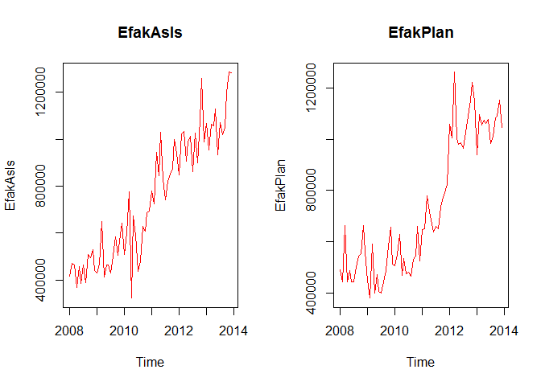<!-- -->

*Discuss Correlation*

    cor(EfakAsIs , EfakPlan)

    ## [1] 0.9055081

*Discuss correlation accuracy*

    EfakAsIs_lm <- lm(EfakAsIs ~ EfakPlan , data = EfakAsIs)
    summary(EfakAsIs_lm)

    ## 
    ## Call:
    ## lm(formula = EfakAsIs ~ EfakPlan, data = EfakAsIs)
    ## 
    ## Residuals:
    ##     Min      1Q  Median      3Q     Max 
    ## -223437  -90637    8593   83869  322479 
    ## 
    ## Coefficients:
    ##              Estimate Std. Error t value Pr(>|t|)    
    ## (Intercept) 7.555e+04  4.005e+04   1.886   0.0634 .  
    ## EfakPlan    9.236e-01  5.173e-02  17.854   <2e-16 ***
    ## ---
    ## Signif. codes:  0 '***' 0.001 '**' 0.01 '*' 0.05 '.' 0.1 ' ' 1
    ## 
    ## Residual standard error: 113600 on 70 degrees of freedom
    ## Multiple R-squared:  0.8199, Adjusted R-squared:  0.8174 
    ## F-statistic: 318.8 on 1 and 70 DF,  p-value: < 2.2e-16

    EfakAsIs_tslm <- tslm(EfakAsIs ~ EfakPlan )
    summary(EfakAsIs_tslm)

    ## 
    ## Call:
    ## tslm(formula = EfakAsIs ~ EfakPlan)
    ## 
    ## Residuals:
    ##     Min      1Q  Median      3Q     Max 
    ## -223437  -90637    8593   83869  322479 
    ## 
    ## Coefficients:
    ##              Estimate Std. Error t value Pr(>|t|)    
    ## (Intercept) 7.555e+04  4.005e+04   1.886   0.0634 .  
    ## EfakPlan    9.236e-01  5.173e-02  17.854   <2e-16 ***
    ## ---
    ## Signif. codes:  0 '***' 0.001 '**' 0.01 '*' 0.05 '.' 0.1 ' ' 1
    ## 
    ## Residual standard error: 113600 on 70 degrees of freedom
    ## Multiple R-squared:  0.8199, Adjusted R-squared:  0.8174 
    ## F-statistic: 318.8 on 1 and 70 DF,  p-value: < 2.2e-16

### Efak STL

    knitr::read_chunk(paste0(DataAnalysis,'/EfakSTL.R'))

*Discuss STL plot and extract comments from .R code chunk*

    # The time series can be analysed using the stl function in order to seperate
    # the trend, seasonality and remainder (remaining coincidential) components from
    # one another.

    EfakAsIs_stl <- stl(EfakAsIs , s.window=9)

    # Thus the individual time series can be shown graphically and tabularly.

    # The trend of the total exports is almost linear. A relatively uniform 
    # seaonality can be seen.

    par(mfrow=c(3,2))

    plot(EfakAsIs_stl, col="black", main="EfakAsIs_stl")

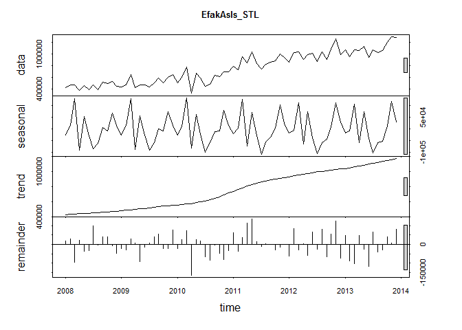<!-- -->

    EfakAsIs_stl

    ##  Call:
    ##  stl(x = EfakAsIs, s.window = 9)
    ## 
    ## Components
    ##              seasonal     trend   remainder
    ## Jan 2008  -24764.2935  424215.0   17138.327
    ## Feb 2008   15831.0144  428674.2   28059.806
    ## Mar 2008  130207.7627  433133.4  -96802.155
    ## Apr 2008  -89604.2059  437592.6   22785.601
    ## May 2008   53655.4937  441695.6  -37610.070
    ## Jun 2008  -28168.2633  445798.5  -32813.285
    ## Jul 2008  -85516.1259  449901.5  100116.605
    ## Aug 2008  -60069.0943  454145.5   -5063.426
    ## Sep 2008    7943.2490  458389.5   42037.232
    ## Oct 2008   -7071.1329  462633.5   40035.615
    ## Nov 2008   68795.5412  467722.8   -7327.353
    ## Dec 2008   16445.8636  472812.1  -47712.969
    ## Jan 2009  -24517.4534  477901.4  -23328.946
    ## Feb 2009   15030.7380  483130.9  -29974.653
    ## Mar 2009  130489.6277  488360.4   29731.942
    ## Apr 2009  -86832.2848  493589.9    8232.339
    ## May 2009   57869.0651  500738.5  -92278.532
    ## Jun 2009  -27027.1196  507887.0  -15084.868
    ## Jul 2009  -90206.2474  515035.5    6158.739
    ## Aug 2009  -59589.5620  522438.5   39650.014
    ## Sep 2009     851.7679  529841.6   54289.645
    ## Oct 2009   -6909.8449  537244.6  -23457.782
    ## Nov 2009   73045.0669  543205.7  -22545.787
    ## Dec 2009   14833.5303  549166.8   77581.656
    ## Jan 2010  -24755.0398  555127.9  -22195.867
    ## Feb 2010   13032.2054  561076.6   27006.164
    ## Mar 2010  134008.6158  567025.4   74962.029
    ## Apr 2010  -82897.5582  572974.1 -166544.521
    ## May 2010   64095.2734  583594.9   24320.793
    ## Jun 2010  -24238.1669  594215.8   19917.379
    ## Jul 2010  -99942.9436  604836.6  -66553.698
    ## Aug 2010  -57381.4168  624421.3  -83676.912
    ## Sep 2010  -10865.7682  644006.0   -3076.248
    ## Oct 2010   -6769.0932  663590.7  -47879.610
    ## Nov 2010   81404.4940  687749.1  -81098.578
    ## Dec 2010   15859.6431  711907.5  -34709.109
    ## Jan 2011  -20725.1613  736065.8   63302.314
    ## Feb 2011    4640.5850  758789.4  -37175.952
    ## Mar 2011  126506.6073  781512.9   35254.505
    ## Apr 2011  -71671.1699  804236.4  112570.762
    ## May 2011   72609.2532  823426.4  134361.369
    ## Jun 2011  -29542.5598  842616.3   16124.211
    ## Jul 2011 -106957.2985  861806.3  -12868.021
    ## Aug 2011  -56180.8353  874743.3    1822.494
    ## Sep 2011  -34706.0440  887680.4   -1546.319
    ## Oct 2011    2834.9631  900617.4  -29557.348
    ## Nov 2011  102441.1450  909955.8  -15780.975
    ## Dec 2011   24243.0806  919294.3   -1926.356
    ## Jan 2012  -18009.0673  928632.7  -61214.654
    ## Feb 2012   -3670.4398  940136.7   85007.773
    ## Mar 2012  113699.8439  951640.6  -31315.457
    ## Apr 2012  -63397.5364  963144.6    4701.978
    ## May 2012   73612.6954  973444.0  -60604.672
    ## Jun 2012  -38582.2807  983743.4   66325.886
    ## Jul 2012 -103993.5049  994042.8  -27810.308
    ## Aug 2012  -57435.0433 1001328.7   82463.345
    ## Sep 2012  -44905.1318 1008614.6  -64817.451
    ## Oct 2012    9879.7360 1015900.5   54213.796
    ## Nov 2012  111936.5697 1022987.5  124805.940
    ## Dec 2012   29331.9995 1030074.5  -72444.513
    ## Jan 2013  -18049.2165 1037161.5   45984.680
    ## Feb 2013   -6901.6162 1048193.9  -89097.308
    ## Mar 2013  106628.4564 1059226.3 -102962.768
    ## Apr 2013  -58865.3148 1070258.7   46594.616
    ## May 2013   73499.4031 1082162.2  -27729.613
    ## Jun 2013  -41914.5970 1094065.7 -118786.124
    ## Jul 2013 -103470.7481 1105969.2   67368.515
    ## Aug 2013  -56721.4519 1118541.3  -41741.860
    ## Sep 2013  -51170.4991 1131113.4  -29972.893
    ## Oct 2013   13783.1826 1143685.5   39983.346
    ## Nov 2013  118472.3596 1157162.1    8335.554
    ## Dec 2013   30102.5772 1170638.7   80093.721

    # It is interesting to note that the almost linear trend is not seen in the 
    # individual segments. The individual trends run partially in opposite 
    # directions in the middle of the time scale, which causes the linear trend 
    # in the total As Is data.

*Discuss Trend*

    par(mfrow=c(1,1))

    plot(EfakAsIs_stl$time.series[,"trend"], col="red")

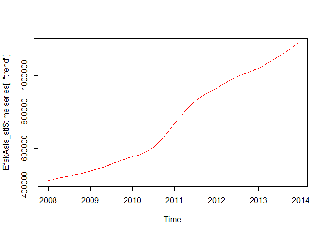<!-- -->

### Efak Monthly Seasonal

    knitr::read_chunk(paste0(DataAnalysis,'/EfakSeasonal.R'))

*Discuss and extract comments*

    # The modification of the seasonlity component can also be changed into a
    # monthly view. It only makes sense to do this if the seasonality componant as
    # the trend looks almost identical and the remainder is then randomly spread. 

    monthplot(EfakAsIs_stl$time.series[,"seasonal"], main="", ylab="Seasonal")

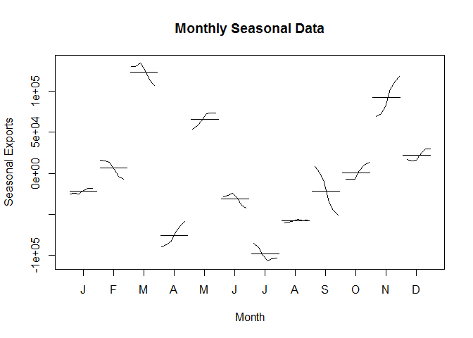<!-- -->

### Efak External Indicator Correlation

    knitr::read_chunk(paste0(DataAnalysis,'/EfakExtCorrelation.R'))

### Forecasting Efak models with smoothing and related approaches

    knitr::read_chunk(paste0(DataAnalysis,'/EfakSmoothing.R'))

      # Simple Exponential Smoothing
    Model_ses <- ses(EfakAsIs, h=12)

      # Holt's Linear Trend
    Model_holt_1 <- holt(EfakAsIs,h=12)

      # Holt's Exponential Trend
    Model_holt_2<- holt(EfakAsIs, exponential=TRUE,h=12)

      # Holt's Damped Linear Trend
    Model_holt_3 <- holt(EfakAsIs, damped=TRUE,h=12)

      # Holt's Damped Exponential Trend
    Model_holt_4 <- holt(EfakAsIs, exponential=TRUE, damped=TRUE,h=12)

      # Holt Winters' Seasonal Additive Model
    Model_hw_1 <- hw(EfakAsIs ,seasonal="additive",h=12)

      # Holt Winters' Seasonal Multiplicative Model
    Model_hw_2 <- hw(EfakAsIs ,seasonal="multiplicative",h=12)

      ## Compute Maximum Likelihood Estimation (AIC/AICc/BIC) Values for All Models
    SESMLE<-capture.output(summary(Model_ses))
    SESMLESplit<-unlist(strsplit(SESMLE[19], split=" "))

    Holt_1MLE<-capture.output(summary(Model_holt_1))
    Holt_1MLESplit<-unlist(strsplit(Holt_1MLE[21], split=" "))

    Holt_2MLE<-capture.output(summary(Model_holt_2))
    Holt_2MLESplit<-unlist(strsplit(Holt_2MLE[21], split=" "))

    Holt_3MLE<-capture.output(summary(Model_holt_3))
    Holt_3MLESplit<-unlist(strsplit(Holt_3MLE[22], split=" "))

    Holt_4MLE<-capture.output(summary(Model_holt_4))
    Holt_4MLESplit<-unlist(strsplit(Holt_4MLE[22], split=" "))
    Holt_4MLESplit

    ## [1] "1978.710" "1979.619" "1990.093"

    hw_1MLE<-capture.output(summary(Model_hw_1))
    hw_1MLESplit<-unlist(strsplit(hw_1MLE[24], split=" "))

    hw_2MLE<-capture.output(summary(Model_hw_2))
    hw_2MLESplit<-unlist(strsplit(hw_2MLE[24], split=" "))

    ModelMLE<- rbind(
                     cbind(ModelType = "Simple Exponential Smoothing",                 ModelTypeAbbr = "SES",       as.data.frame(cbind(SESMLESplit[1],SESMLESplit[2],SESMLESplit[3]))),
                     cbind(ModelType = "Holt's Linear Trend",                          ModelTypeAbbr = "HLT",       as.data.frame(cbind(Holt_1MLESplit[1],Holt_1MLESplit[2],Holt_1MLESplit[3]))),
                     cbind(ModelType = "Holt's Exponential Trend",                     ModelTypeAbbr = "HET",       as.data.frame(cbind(Holt_2MLESplit[1],Holt_2MLESplit[2],Holt_2MLESplit[3]))),
                     cbind(ModelType = "Holt's Damped Linear Trend",                   ModelTypeAbbr = "HDLT",      as.data.frame(cbind(Holt_3MLESplit[1],Holt_3MLESplit[2],Holt_3MLESplit[3]))),
                     cbind(ModelType = "Holt's Damped Exponential Trend",              ModelTypeAbbr = "HDET",      as.data.frame(cbind(Holt_4MLESplit[1],Holt_4MLESplit[2],Holt_4MLESplit[3]))),
                     cbind(ModelType = "Holt Winters' Seasonal Additive Model",        ModelTypeAbbr = "HWSA",      as.data.frame(cbind(hw_1MLESplit[1],hw_1MLESplit[2],hw_1MLESplit[3]))),
                     cbind(ModelType = "Holt Winters' Seasonal Multiplicative Model",  ModelTypeAbbr = "HWSM",      as.data.frame(cbind(hw_2MLESplit[1],hw_2MLESplit[2],hw_2MLESplit[3])))
                    )
    row.names(ModelMLE)<-NULL #reset row.names, so they will not display in formattable output
    names(ModelMLE)<-c("ModelType","ModelTypeAbbr","AIC", "AICc", "BIC")
    formattable(ModelMLE)

<table style="width:125%;">
<colgroup>
<col width="62%" />
<col width="20%" />
<col width="13%" />
<col width="13%" />
<col width="13%" />
</colgroup>
<thead>
<tr class="header">
<th align="right">ModelType</th>
<th align="right">ModelTypeAbbr</th>
<th align="right">AIC</th>
<th align="right">AICc</th>
<th align="right">BIC</th>
</tr>
</thead>
<tbody>
<tr class="odd">
<td align="right">Simple Exponential Smoothing</td>
<td align="right">SES</td>
<td align="right">1977.827</td>
<td align="right">1978.001</td>
<td align="right">1982.380</td>
</tr>
<tr class="even">
<td align="right">Holt's Linear Trend</td>
<td align="right">HLT</td>
<td align="right">1975.610</td>
<td align="right">1976.207</td>
<td align="right">1984.717</td>
</tr>
<tr class="odd">
<td align="right">Holt's Exponential Trend</td>
<td align="right">HET</td>
<td align="right">1975.029</td>
<td align="right">1975.626</td>
<td align="right">1984.136</td>
</tr>
<tr class="even">
<td align="right">Holt's Damped Linear Trend</td>
<td align="right">HDLT</td>
<td align="right">1979.044</td>
<td align="right">1979.953</td>
<td align="right">1990.427</td>
</tr>
<tr class="odd">
<td align="right">Holt's Damped Exponential Trend</td>
<td align="right">HDET</td>
<td align="right">1978.710</td>
<td align="right">1979.619</td>
<td align="right">1990.093</td>
</tr>
<tr class="even">
<td align="right">Holt Winters' Seasonal Additive Model</td>
<td align="right">HWSA</td>
<td align="right">1958.925</td>
<td align="right">1968.816</td>
<td align="right">1995.352</td>
</tr>
<tr class="odd">
<td align="right">Holt Winters' Seasonal Multiplicative Model</td>
<td align="right">HWSM</td>
<td align="right">1964.418</td>
<td align="right">1974.309</td>
<td align="right">2000.844</td>
</tr>
</tbody>
</table>

      ## Compute Error Values for All Models
    ModelError<- rbind(
                       cbind(ModelType = "Simple Exponential Smoothing",                 ModelTypeAbbr = "SES",       as.data.frame(accuracy(Model_ses))),
                       cbind(ModelType = "Holt's Linear Trend",                          ModelTypeAbbr = "HLT",       as.data.frame(accuracy(Model_holt_1))),
                       cbind(ModelType = "Holt's Exponential Trend",                     ModelTypeAbbr = "HET",       as.data.frame(accuracy(Model_holt_2))),
                       cbind(ModelType = "Holt's Damped Linear Trend",                   ModelTypeAbbr = "HDLT",      as.data.frame(accuracy(Model_holt_3))),
                       cbind(ModelType = "Holt's Damped Exponential Trend",              ModelTypeAbbr = "HDET",      as.data.frame(accuracy(Model_holt_4))),
                       cbind(ModelType = "Holt Winters' Seasonal Additive Model",        ModelTypeAbbr = "HWSA",      as.data.frame(accuracy(Model_hw_1))),
                       cbind(ModelType = "Holt Winters' Seasonal Multiplicative Model",  ModelTypeAbbr = "HWSM",      as.data.frame(accuracy(Model_hw_2)))
                      )
    row.names(ModelError)<-NULL #reset row.names, so they will not display in formattable output

    MEFORMAT<-formatter("span", style = ~ ifelse(ME < 10000, "background-color:LightGreen", NA))
    RMSEFORMAT<-formatter("span", style = ~ ifelse(RMSE < 100000, "background-color:LightGreen", NA))

    formattable(ModelError,list(ME=MEFORMAT, RMSE=RMSEFORMAT))       

<table style="width:347%;">
<colgroup>
<col width="62%" />
<col width="20%" />
<col width="93%" />
<col width="93%" />
<col width="13%" />
<col width="16%" />
<col width="15%" />
<col width="15%" />
<col width="16%" />
</colgroup>
<thead>
<tr class="header">
<th align="right">ModelType</th>
<th align="right">ModelTypeAbbr</th>
<th align="right">ME</th>
<th align="right">RMSE</th>
<th align="right">MAE</th>
<th align="right">MPE</th>
<th align="right">MAPE</th>
<th align="right">MASE</th>
<th align="right">ACF1</th>
</tr>
</thead>
<tbody>
<tr class="odd">
<td align="right">Simple Exponential Smoothing</td>
<td align="right">SES</td>
<td align="right">28255.5686974526</td>
<td align="right">105746.360129531</td>
<td align="right">83785.28</td>
<td align="right">1.6185322</td>
<td align="right">12.240714</td>
<td align="right">0.5987073</td>
<td align="right">-0.1644141</td>
</tr>
<tr class="even">
<td align="right">Holt's Linear Trend</td>
<td align="right">HLT</td>
<td align="right">12981.2433596182</td>
<td align="right">101278.188624904</td>
<td align="right">78180.91</td>
<td align="right">-0.3405668</td>
<td align="right">11.623790</td>
<td align="right">0.5586599</td>
<td align="right">-0.0379501</td>
</tr>
<tr class="odd">
<td align="right">Holt's Exponential Trend</td>
<td align="right">HET</td>
<td align="right">1027.78652647737</td>
<td align="right">99625.5017561852</td>
<td align="right">76933.69</td>
<td align="right">-2.0695411</td>
<td align="right">11.565285</td>
<td align="right">0.5497476</td>
<td align="right">-0.0136902</td>
</tr>
<tr class="even">
<td align="right">Holt's Damped Linear Trend</td>
<td align="right">HDLT</td>
<td align="right">15606.5778392227</td>
<td align="right">102291.450636505</td>
<td align="right">78689.55</td>
<td align="right">0.0337458</td>
<td align="right">11.662257</td>
<td align="right">0.5622945</td>
<td align="right">-0.0341930</td>
</tr>
<tr class="odd">
<td align="right">Holt's Damped Exponential Trend</td>
<td align="right">HDET</td>
<td align="right">3135.94744889523</td>
<td align="right">101334.425371825</td>
<td align="right">77773.93</td>
<td align="right">-2.4240518</td>
<td align="right">11.858425</td>
<td align="right">0.5557518</td>
<td align="right">-0.0744258</td>
</tr>
<tr class="even">
<td align="right">Holt Winters' Seasonal Additive Model</td>
<td align="right">HWSA</td>
<td align="right">8710.85874215872</td>
<td align="right">76350.8064264007</td>
<td align="right">61147.93</td>
<td align="right">-0.2519017</td>
<td align="right">8.973478</td>
<td align="right">0.4369468</td>
<td align="right">-0.0912664</td>
</tr>
<tr class="odd">
<td align="right">Holt Winters' Seasonal Multiplicative Model</td>
<td align="right">HWSM</td>
<td align="right">6211.72593543445</td>
<td align="right">83390.079343758</td>
<td align="right">64171.99</td>
<td align="right">-0.6174998</td>
<td align="right">9.086466</td>
<td align="right">0.4585560</td>
<td align="right">-0.1381724</td>
</tr>
</tbody>
</table>

    plot(Model_ses, plot.conf=FALSE, ylab="Exports Chulwalar  )", xlab="Year", main="", fcol="white", type="o")
    lines(fitted(Model_ses), col="green", type="o")
    lines(Model_ses$mean, col="blue", type="o")
    legend("topleft",lty=1, col=c(1,"green"), c("data", expression(alpha == 0.671)),pch=1)

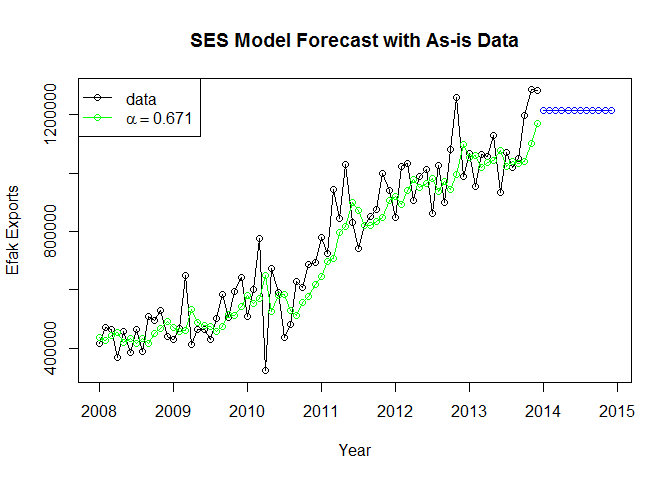<!-- -->

    plot(Model_holt_1)

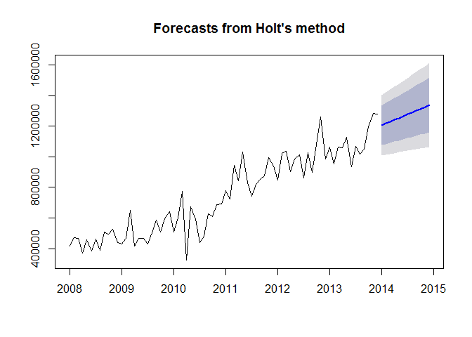<!-- -->

    plot(Model_holt_2)

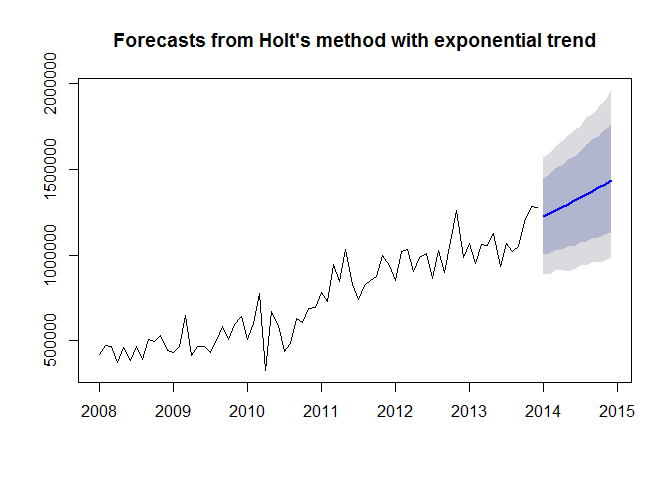<!-- -->

    plot(Model_holt_3)

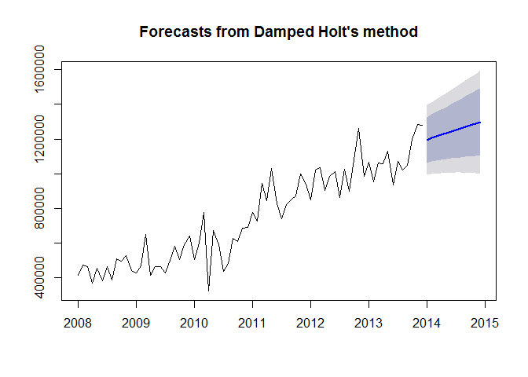<!-- -->

    plot(Model_holt_4)

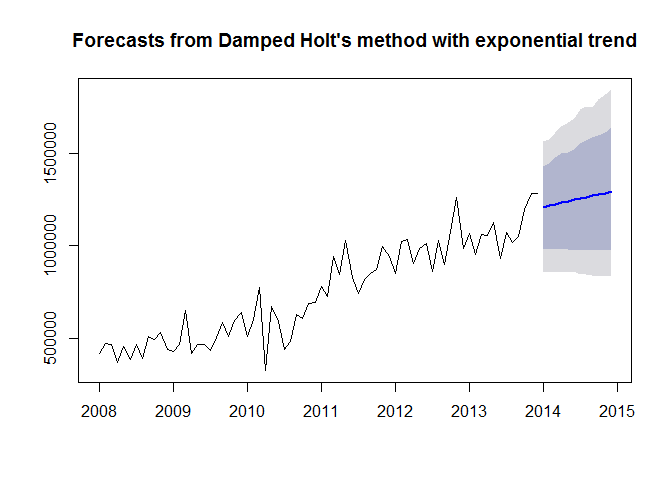<!-- -->

    plot(Model_hw_1)

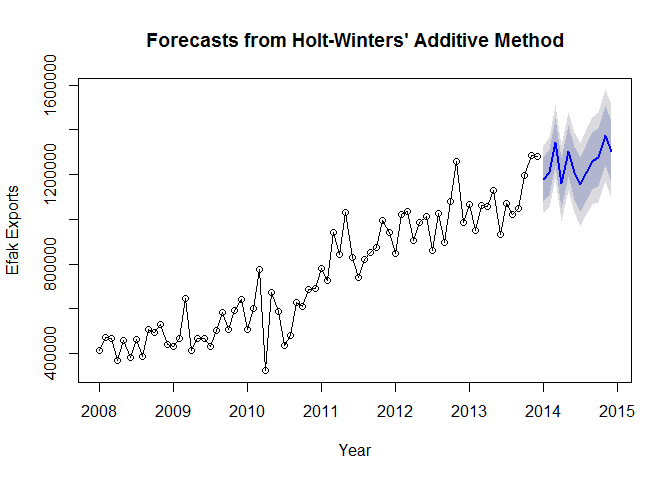<!-- -->

    plot(Model_hw_2)

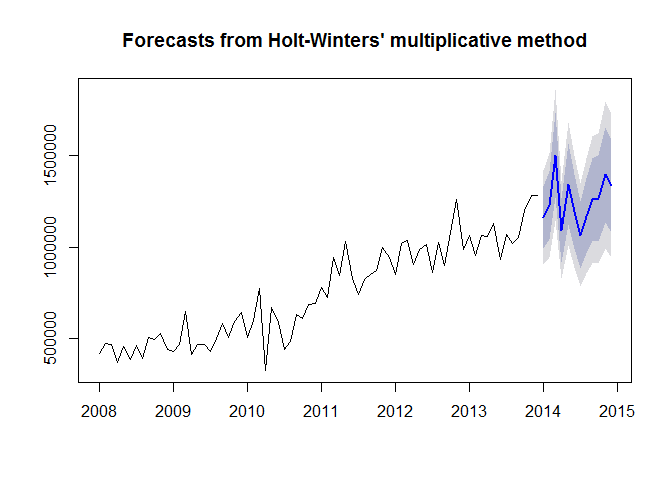<!-- -->

Conclusion
==========

Conclusion Text Goes Here....
