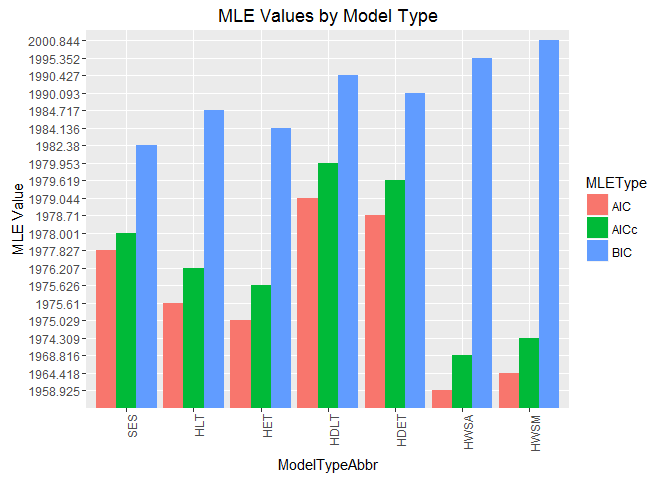
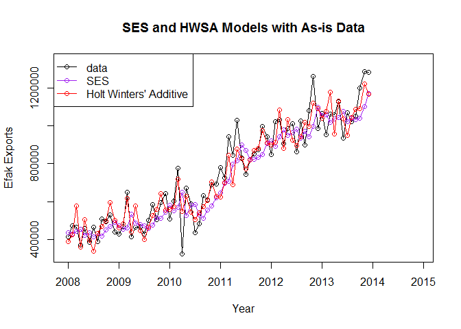

Introduction
============

Our client, the Prime Minister of Chulwalar has recruited our small team
of SMU data scientists to assist in forecasting Efak (A beautiful flower
unique to the region of Chulwalar) exports from his country. He has
provided us with historical, as-is flower export data, planned export
data, and external key indicators unique to Chulwalar (All historical
data provided by month from 2008-2013). It is our duty to best forecast
Chulwalar Efak exports in the upcoming year (2014) based on existing
export data.

There are several steps needed to accomplish this task. These steps are
summarized as follows:

-   Load all data sets
-   Clean and prepare as-is, planned, and external indicator data for
    analysis
-   Observe correlation between as-is and planned exports
-   Plot seasonal and trend decomposition using Loess (STL) for as-is
    export data
-   Plot seasonal trends by month
-   Perform exploratory data analysis (EDA) to better understand effects
    of external indicators
-   Utilize smoothing techniques to forecast future exports

### Required Packages

This RMD requires the following R packages to run:

-   formattable
-   fpp
-   ggplot2
-   reshape2

Data Load
=========

As this analysis consists of historical export data, planned data, and
external indicator data, each data set is stored in one of three CSV
files. These files are:

-   ImportedAsIsDataChulwalar.csv
-   ImportedPlanDataChulwalar.csv
-   ImportedIndicatorsChulwalar.csv

### AsIs Chulwalar Data

To start, we need to load our As Is Chulwar Data. This data has been
sourced from the SMU 2DS platform Unit 10.2 Overview page.

With our data loaded, we reviewed the structure and a small subset of
the data to confirm successful import.

After reviewing this subset of data, we discovered we have some cleanup
to do. It appears we have loaded one column for each year of data by
month(row). All export group information (TotalAsIs, Efak, Wuge,
TotalEtel, BlueEtel, RedEtel, and TotalYearly) has also been combined
into a list by repeating month/year data for each export group in
subsequent rows. We will need to parse this data to create a data
structure that is easier to analyze.

### Plan Chulwalar Data

Similarly, the second data set loaded is the planned export data. These
data are also obtained from SMU 2DS and loaded as follows:

Once again, the data structure and subset rows were reviewed to confirm
succesful import.

Similar to the as-is data set, structure and subset row review indicates
there are multiple groups (TotalPlan, Efak, Wuge, TotalEtel, BlueEtel,
RedEtel, YearPlan, and TotalPlan\_2014) of data within the single CSV
file that need divided accordingly. In order to do so, these data will
need parsed during cleanup and assigned to a data frame for efficient
analysis.

### External Indicator Chulwalar Data

Finally, the third data set loaded is the Chulwar external indicator
data. Again, the data set has been sourced from the SMU 2DS platform
Unit 10.2 Overview page:

Reviewing the external indicator data post-import confirms successful
loading.

As before, review indicates there are multiple groups (Export Price
Changes, Satisfaction Index (Gov), Average Temperature, Births,
Satisfaction Index (Independent), Total Exports from Urbano,
Globalization Party Members, Average Export Price, Etel Production Price
Index, Chulwalar Index, Inflation, Spending for Chulwalar Days,
Chulwalar Days, and Influence of Chulwalar Days) of data within the
single CSV file that need split by group. In order to do so, these data
once again need parsed during cleanup and assigned to a data frame
before analysis.

Data Cleanup
============

Data cleanup is imperative to any data analysis. In our precursory view
into header/footer records, we can tell there are several items needing
to be cleaned across the three data sets. The following sections will
walk through cleaning the data to prep for analysis.

### AsIs Data Cleanup

To clean our as-is Chulwar data, we first separate each export group
(e.g. TotalAsIs, Efak, Wuge, etc.) into individual vectors. Following
this, we convert each new vector into a time series. Finally, we review
each time series output to ensure they match our expectations.

### Plan Data Cleanup

To clean our planned Chulwar data, we once again separate each planned
export group into individual vectors. After this, we convert each new
vector into a time series and then review each time series output to
ensure they match our expectations. The time series output was as
expected.

### External Indicators Data Cleanup

Finally, to clean the external indicators data, we separate each
indicator group into individual vectors. Then, as done previously, we
convert each new vector into a time series. Lastly, we review each time
series output to ensure they match what we expect to see.

Data Analysis
=============

With the data cleaned, we are ready to proceed with our analysis. To
recap, while we are interested in forecasting Efak exports for 2014, we
are also interested in performing exploratory data analysis to identify
potential trends, seasonal fluctuation, and the strength of various
correlations.

### Efak Correlation

The first approach to EDA is to review historical exports against
Chulwalar's planned exports. This correlation will validate the prime
minister's planning committee estimates for previous years, identify
gaps in planning efforts, and will help us to better forecast 2014
exports. This will essentially provide a baseline by which we may
measure our own estimate accuracy.

Based on the as-is and planned export data plotted below, it appears
there may be inconsistencies regarding planning methodology. It looks as
though extreme adjustments were made between 2011 and 2012 to realign
plans with true exports. The plots suggest adjustments were too extreme,
resulting in some oscillations through the end of 2013.

    par(mfrow=c(1,2))

    plot(EfakAsIs , col="red",main="EfakAsIs")
    plot(EfakPlan , col="red",main="EfakPlan")

<!-- -->

The next step is to observe the association between planned and as-is
exports. Pearson's r is therefore calculated and the resulting r value
is `0.906`. This indicates there is a strong, positive correlation
between both types of Efak exports. We aknowledge that `0.906`, though
strong, presents some room for improvement.

    cor(EfakAsIs , EfakPlan, method = "pearson")

    ## [1] 0.9055081

Though Pearson's r does suggest a strong association between planned and
as-is exports, a hypostheses test provides added insight into the
correlation's statistical significance. Our null hypotheis is that the
slope of our linear model is 0, whereas our alternative hypothesis is
that it is not 0. Based on the results presented below, the p-value is
equal to &lt;2e-16, meaning we reject the null hypothesis. There is
sufficient evidence to suggest the slope of the linear model between
planned and as-is exports is not equal to 0.

    EfakAsIs_tslm <- tslm(EfakAsIs ~ EfakPlan )
    summary(EfakAsIs_tslm)

    ## 
    ## Call:
    ## tslm(formula = EfakAsIs ~ EfakPlan)
    ## 
    ## Residuals:
    ##     Min      1Q  Median      3Q     Max 
    ## -223437  -90637    8593   83869  322479 
    ## 
    ## Coefficients:
    ##              Estimate Std. Error t value Pr(>|t|)    
    ## (Intercept) 7.555e+04  4.005e+04   1.886   0.0634 .  
    ## EfakPlan    9.236e-01  5.173e-02  17.854   <2e-16 ***
    ## ---
    ## Signif. codes:  0 '***' 0.001 '**' 0.01 '*' 0.05 '.' 0.1 ' ' 1
    ## 
    ## Residual standard error: 113600 on 70 degrees of freedom
    ## Multiple R-squared:  0.8199, Adjusted R-squared:  0.8174 
    ## F-statistic: 318.8 on 1 and 70 DF,  p-value: < 2.2e-16

### Efak STL

Now having a clearer understanding of the association between as-is and
planned Efak export, the next step is to review the as-is export trend,
seasonality, and remaining coincidential componenents. Utilizing the STL
function, we are able to seperate these components and plot them one
after the other.

Refering to the trend segment below, it is clear there is a nearly
linear increase in exports over time. The seasonality component
indicates a large number of exports toward the beginning of each year.
There appears to be a consistent decrease in exports during the Summer
months before steadily increasing again each year. Finally, the
remainder plot displays anomalies beyond observed Efak export trend and
seasonal behaviors.

    EfakAsIs_stl <- stl(EfakAsIs , s.window=9)

    par(mfrow=c(1,1))

    plot(EfakAsIs_stl, col="black", main="EfakAsIs_stl")

<!-- -->

### Efak Monthly Seasonal

To further clarify the seasonal trend observed for our data, the
seasonality component is plotted by month. The plot below confirms our
previous observations that exports are high around the month of March,
fluctuate between April and May, and then consistently drop during the
Summer months. This monthly plot also shows the gradual increase in
exports from July through the end of the year. It is worth mentioning a
sharp decrease in September exports is observed between 2008-2013.
Similarly, a substantial increase in exports is observed for the month
of November. Since the September drop in exports is alarming, it is
worth notifying the Chulwalar Prime Minister so that improvements can be
made.

    monthplot(EfakAsIs_stl$time.series[,"seasonal"], main="", ylab="Seasonal")

<!-- -->

### Efak External Indicator Correlation

After extensive EDA on several external indicator factors, two
indicators have been identified as noteworthy. The first indicator is
monthly change in export price index (CEPI) and the second is climate
temperature.

The CEPI plot below indicates a strong, nearly linear, increase in price
index between 2008 and 2013. This results in a strong Pearson's r value
of `0.93`, representing significant association with increase in
exports.

    # Monthly Change in Export Price Index (CEPI)
    plot(CEPI, main="CEPI")

<!-- -->

    cor(EfakAsIs , CEPI)

    ## [1] 0.9303543

Because strong correlation is observed, it is beneficial to also compare
the seasonal component from CEPI and Efak Exports. Based on the
following plots, it is apparent that prices are highest during months
when Efak exports are lowest and vice-versa. Modifications to export
pricing strategies may mitigate the effects of seasonal oscillations
throughout the year.

    par(mfrow=c(2,1))
    CEPI_stl <- stl(CEPI , s.window=9)
    plot(CEPI_stl$time.series[,"seasonal"], col="black", ylab = "CEPI", main = "Seasonal CEPI")
    plot(EfakAsIs_stl$time.series[,"seasonal"], col="black", ylab = "Exports", main = "Seasonal Efak Exports")

<!-- -->

The second indicator of interest is temperature. One would expect
changes in temperature throughout the year to play a significant role in
flower yields and thus impact the number of exports. In reviewing the
correlation between temparature and Efak exports, a Pearson's r of
`-0.08` is produced. This is rather surprising given our aforementioned
assumption.

    # Average monthly temperatures in Chulwalar
    cor(EfakAsIs , Temperature)

    ## [1] -0.07951179

Further investigation yields the following STL plots. The raw data and
seasonal component follow the same pattern as expected and there is no
observable increase in temperature over the years. The steady
temperature trend is likely great cause for our low Pearson's r value.

    par(mfrow=c(1,1))
    Temperature_stl <- stl(Temperature , s.window=9)
    plot(Temperature_stl, main = "Temperature_STL")

<!-- -->

Because of the seasonal nature of the export and temperature data, it
makes sense to compare the seasonal component for Efak exports to the
changing temperature. The following plots confirm our original
assumptions that temperature likely has a negative impact on exports
during high temperature months.

    par(mfrow=c(2,1))
    plot(Temperature, main="Temperature")
    plot(EfakAsIs_stl$time.series[,"seasonal"], col="black", ylab = "Exports", main = "Seasonal Efak Exports")

<!-- -->

    # The temperatures have a negative correlation, exports                      
    # increase in the colder months. However, the relationship is only stronger 
    # with blue Etels.

### Forecasting Efak models with smoothing and related approaches

Now that all EDA steps are complete, we are ready to run our forecast
models. Several models are available for time series forecasting. The
models used in this analysis are:

-   Simple Exponential Smoothing (SES)
-   Holt's Linear Trend (HLT)
-   Holt's Exponential Trend (HET)
-   Holt's Damped Linear Trend (HDLT)
-   Holt's Damped Exponential Trend (HDET)
-   Holt-Winters' Seasonal Additive Model (HWSA)
-   Holt-Winters' Seasonal Multiplicative Model (HWSM)

<!-- -->

      # Simple Exponential Smoothing
    Model_ses <- ses(EfakAsIs, h=12)

      # Holt's Linear Trend
    Model_holt_1 <- holt(EfakAsIs,h=12)

      # Holt's Exponential Trend
    Model_holt_2<- holt(EfakAsIs, exponential=TRUE,h=12)

      # Holt's Damped Linear Trend
    Model_holt_3 <- holt(EfakAsIs, damped=TRUE,h=12)

      # Holt's Damped Exponential Trend
    Model_holt_4 <- holt(EfakAsIs, exponential=TRUE, damped=TRUE,h=12)

      # Holt Winters' Seasonal Additive Model
    Model_hw_1 <- hw(EfakAsIs ,seasonal="additive",h=12)

      # Holt Winters' Seasonal Multiplicative Model
    Model_hw_2 <- hw(EfakAsIs ,seasonal="multiplicative",h=12)

The Akaike’s Information Criterion (AIC), Akaike's Information Criterion
Corrected (AICc), and Bayesian Information Criterion (BIC) are Maximum
Likelihood Estimators (MLE). These are important measures of goodness of
fit, and as such, their values are extracted from each model's summary
output and assigned to a data frame for later analysis. The resulting
data frame is as follows.

Minimum AIC/AICc/BIC values are highlighted in green, representing the
best goodness of fit for the corresponding models. The Holt-Winters'
Seasonal Additive Model contains the lowest AIC and AICc values whereas
the Simple Exponential Smoothing model has the lowest value for BIC.
Given that the Holt-Winters' Seasonal Additive and Simple Exponential
Smoothing models have the smallest values, this is an early indicator
that these models may be the best fit for Efak as-is data.

To further illustrate the difference in MLE measures, the AIC/AICc/BIC
values are plotted for each model type. As indicted in the previous
table, the Holt-Winters' Seasonal Additive and Simple Exponential
Smoothing models depict the smallest measures. It is worth noting that
the Holt-Winters' Seasonal Additive model has the second smallest BIC
value and that while its multiplicative version has the second smallest
AIC/AICc values, the multiplicative model portrays the largest BIC
value. For these reasons, it is important to consider all available
measures holistically as will be done further momentarily.

    ModelMLEMelt<-melt(ModelMLE, id.vars = c("ModelType","ModelTypeAbbr"),variable.name="MLEType",value.name = "MLEValue")
    #formattable(ModelMLEMelt)

    ggplot(ModelMLEMelt, aes(x = ModelTypeAbbr,y=as.factor(MLEValue), fill = MLEType)) +
    geom_bar(stat="identity" ,position=position_dodge()) +
    theme(axis.text.x = element_text(angle = 90, hjust = 1))

<!-- -->

Similar to AIC/AICc/BIC measures, various summary measures of forecast
accuracy exist in the form of error values. The error measures used in
this analysis are:

-   Mean Error (ME)
-   Root Mean Squared Error (RMSE)
-   Mean Absolute Error (MAE)
-   Mean Percentage Error (MPE)
-   Mean Absolute Percentage Error (MAPE)
-   Mean Absolute Scaled Error (MASE)
-   Autocorrelation of Errors at Lag 1 (ACF1)

The below table provides a summary of all error measures with the
smallest model error highlighted for each error type. Since the
Holt-Winters' Seasonal Additive model has the smallest AIC/AICc values
as discussed in our MLE review above, the fact that this additive model
portrays four of the smallest error values seems rather significant. Of
additional note, the Simple Exponential Smoothing model depicts at least
one of the smallest error measures. For these reasons, the Holt-Winters'
Seasonal Additive and Simple Exponential Smoothing models will be chosen
for Chulwalar Efak export forecasting analysis.

Before any forecasts are made, it is important to visualize model fit
for as-is historical data. The following plot provides an overlayed view
of raw as-is data and model fit lines. The Holt-Winters' Seasonal
Additive model is more representative of seasonal changes in the raw
data whereas the Simple Exponential Smoothing model provides a clearer
summary of mean trend behavior.

    plot(Model_holt_1, plot.conf=FALSE, ylab="Exports Chulwalar", xlab="Year", main="", fcol="white", type="o")
    lines(fitted(Model_ses), col="purple", type="o")
    lines(fitted(Model_hw_1), col="red", type="o")
    legend("topleft",lty=1, col=c(1,"purple","red"), c("data", "SES","Holt Winters' Additive"),pch=1)

<!-- -->

The Simple Exponential Smoothing model is again plotted below with the
raw as-is historical data. While this model does not appear to be
sensitive to seasonal fluctuations in exports, it does provide a good
representation of overall trend. The extent to which seasonal
fluctuations are smoothed is dependent on the smoothing parameter, or
alpha. This smoothing parameter operates as a weighted average in which
older values are less influential on model forecasts.

The model's export forecast is indicated by the blue line for the year
2014. Since this model calculates a single forecasting constant which
remains for all of 2014, it does not account for the positive trends
observed among historical data. This, along with the loss of a seasonal
component when forecasting, is the Simple Exponential Smoothing model's
biggest weakness.

    par(mfrow=c(1,1))
    plot(Model_ses, plot.conf=FALSE, ylab="Exports Chulwalar", xlab="Year", main="", fcol="white", type="o")
    lines(fitted(Model_ses), col="green", type="o")
    lines(Model_ses$mean, col="blue", type="o")
    legend("topleft",lty=1, col=c(1,"green"), c("data", expression(alpha == 0.671)),pch=1)

<!-- -->

When reviewing the Holt-Winters' Seasonal Additive forecast with raw
historical data below, it is clear this model not only depicts the
export positive trend in the future, but it also accounts for the
effects of seasonality. The model parameter gamma incorporates seasonal
smoothing into the model calculation. In this case, gamma is set to a
default estimated value. These additional components provide evidence to
suggest the Holt-Winters' Seasonal Additive model is a better fit for
forecasting as-is to future export data.

    plot(Model_hw_1, type = "o")

<!-- -->

Conclusion
==========

The Prime Minister of Chulwalar requires assistance forecasting Efak
exports based on historical as-is data. He has provided not only
historical as-is data but also historical export plans and Chulwalar
external indicators of interest. Throughout the EDA process in
preparation for export forecasting, we've identified additional
insightful information beyond a forecast model alone. As-is vs. planned
export data has been reviewed as well as seasonal and trend
decomposition using Loess for as-is data. Seasonal trend review was
extended to a month-by-month comparison across all years (2008-2013),
and the effects of external indicators, CEPI and Temperature, were
analyzed in particular detail.

EDA produced several insights as mentioned. The first is in regards to
correlation between as-is vs. planned Efak exports. The Pearson's r is
`0.906`, indicating a strong, positive correlation between as-is and
planned exports. This correlation value provides a good baseline for
measuring our forecasts at the end of 2014. The second step of analyzing
as-is export STL components provided significant insight toward the
seasonal behavior surrounding exports. This led to digging deeper into
the seasonal trends for as-is exports, resulting in step three. In the
third step, month-by-month review confirmed consistency in the seasonal
trend across the years (primarily a spike early each year followed by a
dip during the Summer). Finally, the fourth step provides insight into
the association between Efak exports and external indicators. After
reviewing all external indicators, the monthly Change in Export Price
Index (CEPI) and climate temperatures yielded the most interesting
results. Like Efak exports, CEPI exhibits a strong positive trend
between 2008 and 2014, and it was identified that price index is highest
when Efak exports are lowest and vice-versa. Though the Pearson's r
(`-0.08`) for the association between Efak exports and temperature is
non-indicative of a strong correlation, the seasonal components for
exports and temperature confirm our original assumptions that
temperature has a negative impact on exports during high temperature
months. The reason for a small Pearson's r value is likely caused by a
steady mean temperature over the years.

With EDA complete, efforts shift to identify an appropriate forecast
model. Various time-series models were analyzed, maximum likelihood
estimators, and error measures were compared holistically across all
models to assess potential best fit. It was identified that Simple
Exponential Smoothing and Holt-Winters' Seasonal Additive models
consistently contain lowest values from both MLE and error measures.
These indicators led to further analysis of these models. Plotting each
model with historical as-is data provides visual insight to not only
forecasted values but also model performance as measured against
historical exports. Between the Simple Exponential Smoothing and
Holt-Winters' Seasonal Additive models, the additive model encompasses
the positive correlation and seasonal trends observed in the Chulwalar
as-is Efak export data. Due to these factors, the forecast model of
choice is the Holt-Winters' Seasonal Additive model. A consultation has
been scheduled with the Prime Minister in December of 2014 to assess the
accuracy of this forecast and to discuss future forecasting for 2015.
